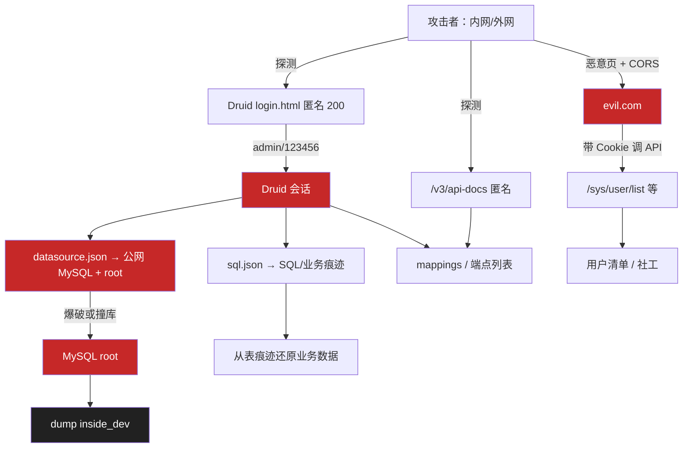

# JeecgBoot 安全评估 · 2026-09-04

## 1. 结论

测试环境当前存在可直达库连接信息的路径：**Druid 默认口令** 可登录监控并读出公网 MySQL 地址与 `root` 用户名；叠加 **CORS 任意源 + Credentials** 与 **Swagger/Druid 匿名可达**，构成「接口面暴露 + 凭证/连接串泄露」组合风险。

**优先止血（建议 24h 内）**：C1 Druid 口令/关停 → C2 CORS 白名单 → H2 关生产 Swagger → H1 收口 3306 / 迁内网 → C3 收紧监控白名单。  
**落地勾选**：见同目录 [20260904_止血Checklist.md](./20260904_止血Checklist.md)（已对齐 `deploy/application-docker.yml.template`）。

| ID | 等级 | 一句话 | Owner | 预估 | 状态 |
|----|------|--------|-------|------|------|
| SEC-20260904-C1 | Critical | Druid `admin/123456` 可登录，泄露 JDBC + SQL 监控 | 后端 | 10m | open |
| SEC-20260904-C2 | Critical | CORS `Allow-Origin` 反射任意源且 `Allow-Credentials: true` | 后端 | 30m | open |
| SEC-20260904-C3 | Critical | Druid/Swagger 进 Security 白名单，监控面半开放 | 后端 | 20m | open |
| SEC-20260904-H1 | High | MySQL 落在公网 IP，且 `useSSL=false` | DBA | 1h | open |
| SEC-20260904-H2 | High | `/v3/api-docs` 匿名返回约 216 业务端点 | 后端 | 10m | open |
| SEC-20260904-H3 | High | Shiro / fastjson / jackson 间接版本需核对 | 后端 | 2h | open |
| SEC-20260904-M1 | Medium | `/sys/common/static/upload` 返回 200 空 body | 运维 | 15m | open |
| SEC-20260904-M2 | Medium | `/sys/login` 未见失败锁定/限流 | 后端 | 1h | open |
| SEC-20260904-L1 | Low | 缺 CSP / X-Frame-Options 等安全响应头 | 前后端 | 30m | open |
| SEC-20260904-L2 | Low | 未上 HSTS（需先 HTTPS） | 运维 | — | open |
| SEC-20260904-L3 | Low | 主机侧 OpenSSH/Redis/邮件端口见独立主机扫描（本次未附） | 运维 | — | open |

**主杀伤链**：匿名访 Druid → 默认口令登录 → `datasource.json` 得公网库地址/`root` → 撞库或读慢 SQL → `inside_dev` 脱库。并行链：CORS + 员工已登录 Cookie → 跨站拉 `/sys/user/list` 等。

---

## 2. 攻击链（示意）



---

## 3. Findings

每个 Finding：**现象 → 证据 → 影响 → 修复要点 → 复测 → 状态**。配置片段为建议方向，落地时以仓库实际 `application-*.yml` / Security 配置为准。

### SEC-20260904-C1 · Druid 默认口令

| 项 | 内容 |
|----|------|
| 位置 | `POST .../druid/submitLogin`；登录后 `datasource.json` / `sql.json` / `spring/mappings` |
| 现象 | 默认 `admin` / `123456` 可登录（框架常见默认凭证） |
| 证据 | 登录后 `datasource.json` 含 `jdbc:mysql://47.107.78.177:3306/inside_dev?...&useSSL=false&allowPublicKeyRetrieval=true`，`UserName=root`（密码未在 JSON 中返回） |
| 影响 | 连接串 + SQL 监控面暴露；配合 H1 可定向撞库 |
| 修复 | 改强口令 + IP allowlist；生产建议 `stat-view-servlet.enabled: false`，改用 SkyWalking / Prometheus |
| 复测 | 默认口令登录失败；未授权访问 `datasource.json` 为 401/403 |
| 状态 | open |

建议配置方向：

```yaml
spring:
  datasource:
    druid:
      stat-view-servlet:
        enabled: true   # 生产优先 false
        login-username: ${DRUID_USER}
        login-password: ${DRUID_PWD}
        allow: 127.0.0.1,192.168.0.0/16
        reset-enable: false
```

### SEC-20260904-C2 · CORS 任意源 + Credentials

| 项 | 内容 |
|----|------|
| 位置 | 业务接口 CORS 响应头（实测如 `/sys/login`） |
| 现象 | `Origin: https://evil.com` 时返回 `Access-Control-Allow-Origin: https://evil.com` 且 `Allow-Credentials: true` |
| 影响 | 员工浏览器若已持会话，恶意页可跨站读敏感 API（用户列表、角色、数据源、Online 表单等） |
| 修复 | `allowedOriginPatterns` 改为业务域白名单；或前端同源反代后后端关闭 CORS |
| 复测 | 非法 Origin 无 ACAO，或拒绝预检 |
| 状态 | open |

### SEC-20260904-C3 · 监控/文档白名单过宽

| 项 | 内容 |
|----|------|
| 现象 | `/actuator/**` 为 401（Security 生效）；但 `/druid/**`、`/doc.html`、`/v3/api-docs` 匿名 200 |
| 影响 | 扩大匿名攻击面，与 C1/H2 叠加 |
| 修复 | 收紧 Security 放行列表；Actuator 仅 `health,info`，改 `base-path`，敏感 endpoint 关闭；文档见 H2 |
| 复测 | 外网/非白名单 IP 不可达 Druid/Swagger；`/actuator/env` 仍不可匿名读明细 |
| 状态 | open |

### SEC-20260904-H1 · 公网 MySQL 暴露面

| 项 | 内容 |
|----|------|
| 现象 | JDBC URL 指向 `47.107.78.177:3306`，`useSSL=false`，用户 `root`，库 `inside_dev` |
| 影响 | 若安全组放行 3306，等同库面裸奔；明文协议利于中间人 |
| 修复 | 安全组拒公网 3306；bind 内网；应用专用账号；`useSSL=true`；库迁至与应用同 VPC（参见部署手册） |
| 复测 | 公网探测 3306 超时/拒绝 |
| 状态 | open |

### SEC-20260904-H2 · Swagger / OpenAPI 匿名全量

| 项 | 内容 |
|----|------|
| 现象 | `/doc.html`、`/v2/api-docs`、`/v3/api-docs`（约 136KB）、`/swagger-resources`、`/webjars/**` 匿名 200；OpenAPI 约 216 端点 |
| 影响 | 零成本拿到业务 API 清单，降低越权/注入探测成本 |
| 修复 | 生产 `springdoc`/`knife4j.production=true` 关闭；或仅内网 IP |
| 复测 | `/doc.html`、`/v3/api-docs` → 404 或 403 |
| 状态 | open |

高敏端点（文档识别、**本次未登录验证**，越权结论待测）：

| 路径 | 方法 | 说明 |
|------|------|------|
| `/sys/user/list` | GET | 用户列表 |
| `/sys/user/delete` | DELETE | 删用户 |
| `/sys/user/importExcel` | POST | 批量导入 |
| `/sys/role/edit` | POST | 改角色 |
| `/sys/dataSource/list` | GET | 数据源配置 |
| `/online/cgform/api/**` | * | Online 表单 CRUD |
| `/sys/formFile/**` | * | 表单文件 |

> 完整 OpenAPI 原件未迁入本仓库；需要时从测试环境重新拉取 `/v3/api-docs` 归档到本目录（注意脱敏）。

### SEC-20260904-H3 · 依赖版本待核对

| 项 | 内容 |
|----|------|
| 关注点 | Shiro 间接依赖、fastjson、jackson-databind 等历史 RCE 面 |
| 修复 | 对齐 JeecgBoot 补丁线；`mvn dependency:tree` 核对；fastjson 开 safeMode 或迁 fastjson2 |
| 复测 | 树中无已知危险旧版；依赖扫描无 Critical |
| 状态 | open |

### SEC-20260904-M1 · 静态上传路径 200

| 项 | 内容 |
|----|------|
| 现象 | `GET /sys/common/static/upload` → 200，空 body |
| 影响 | 若存在目录列举或可猜路径，有文件泄露风险（待证实） |
| 修复 | 反代禁止目录 URI；仅放行真实文件 |
| 状态 | open |

### SEC-20260904-M2 · 登录无限流

| 项 | 内容 |
|----|------|
| 现象 | `/sys/login` 未见失败锁定 / IP 限流 |
| 修复 | 失败计数 + 短时锁定；Redis 故障时 captcha **不可**降级为跳过 |
| 状态 | open |

### SEC-20260904-L1 · 安全响应头缺失

缺：`Content-Security-Policy`、`X-Content-Type-Options`、`X-Frame-Options`、`Referrer-Policy`、`Permissions-Policy`。用 Filter 或网关统一补。状态：open。

### SEC-20260904-L2 · HSTS

HTTPS 上线后再加 `Strict-Transport-Security`。状态：open（依赖 HTTPS）。

### SEC-20260904-L3 · 主机其他端口

OpenSSH / Redis / 邮件等见主机扫描报告（原 workbuddy 侧独立稿，**未附于本仓库**）。状态：open。

---

## 4. 暴露面快照（匿名实测）

前缀均为 `{target_base}`。风险列为当时判断，非 CVSS。

| 路径 | 方法 | HTTP | 关联 Finding |
|------|------|------|----------------|
| `/doc.html` | GET | 200 | H2, C3 |
| `/v2/api-docs` | GET | 200 | H2 |
| `/v3/api-docs` | GET | 200 | H2 |
| `/swagger-resources` | GET | 200 | H2 |
| `/webjars/**` | GET | 200 | H2 |
| `/druid/login.html` | GET | 200 | C1, C3 |
| `/druid/submitLogin` | POST | 302（默认口令） | C1 |
| `/druid/datasource.json` 等 | GET | 200（登录后） | C1 |
| `/sys/randomImage/{key}` | GET | 200 | 正常 |
| `/sys/common/static/upload` | GET | 200（空） | M1 |
| `/actuator` `/actuator/env` `/actuator/health` | GET | 401 | C3（已拦；health 策略可再议） |

---

## 5. 修复路线图

### 阶段 1 · 止血（约 2h 量级）

| # | 动作 | Finding | Owner |
|---|------|---------|-------|
| 1 | Druid 改密或关闭 + IP 限制 | C1 | 后端 |
| 2 | CORS 白名单 | C2 | 后端 |
| 3 | 生产关闭 Swagger/Knife4j | H2 | 后端 |
| 4 | Actuator 收敛 exposure / path | C3 | 后端 |
| 5 | 公网 3306 拒连 / 迁内网 | H1 | DBA |

### 阶段 2 · 加固（约 1 周）

依赖升级与 H3、登录限流 M2、安全头 L1、上传目录 M1、DB 应用账号与改密。

### 阶段 3 · 长期

MySQL 大版本、依赖持续扫描、用 APM 替 Druid、WAF、钓鱼意识。

---

## 6. 复测清单

自动化（修复后对 `{target_base}`）：

- [ ] Druid 默认口令登录失败
- [ ] 未授权 `druid/datasource.json` → 401/403/404
- [ ] `/doc.html`、`/v3/api-docs` → 404/403
- [ ] `Origin: https://evil.com` 无非法 ACAO
- [ ] `/actuator/env` 仍不可匿名读

手工（需测试账号，**本次未做**）：

- [ ] 普通用户访问 `/sys/user/list` → 403
- [ ] 跨部门 Online/业务数据水平隔离
- [ ] 连续失败登录触发锁定
- [ ] Redis 不可用时登录仍要求 captcha
- [ ] 改密后旧 Token 失效
- [ ] 响应头含 `X-Frame-Options` 等

---

## 7. 权限模型备注（推断，未实测）

按 Jeecg 默认模型推断：匿名不应达 Druid/Swagger；普通用户应数据域隔离；超管/数据源/Druid 仅内网。  
待两套测试账号验证：垂直越权、水平越权、Online 租户/部门隔离。

---

## 8. 来源与边界

| 项 | 说明 |
|----|------|
| 原始探测 | 2026-09-04 workbuddy 辅助生成稿；本文件为仓库内唯一归档正文 |
| 主动操作 | 仅 Druid 默认凭证尝试 1 次 |
| 未迁入 | `.workbuddy/jeecg_api.json`、主机 `report.md`、监控截图 |
| 下次建议 | Critical 止血后约 2 周复测；补越权与上传用例 |

引用本报告时请使用 Finding ID（如 `SEC-20260904-C1`），便于检索与状态跟踪。
