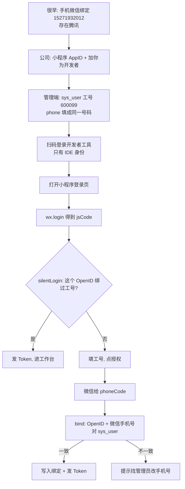

# 微信授权登录 — 从注册微信到进提案系统（脉络复习）

> **用途**：把「手机号到底从哪来、jsCode/phoneCode 何时产生」串成一条时间线，方便日后复习。  
> **操作步骤**（装软件、导入项目）见：[微信开发者工具-小程序联调教程.md](./微信开发者工具-小程序联调教程.md)  
> **产品流程图（归档）**：[assets/wechat-login/登录绑定流程图.png](./assets/wechat-login/登录绑定流程图.png) · [说明](./assets/wechat-login/README.md)  
> **整理日期**：2026-09-01

---

## 一句话

提案小程序 **从不让你手填手机号**。  
号码存在 **腾讯的微信账号** 上；点授权时腾讯告诉后端「这个微信绑的是哪一个号」；后端再和公司 `sys_user.phone` 比对，对上才登录。

---

## 先分清三个「登录」，别混在一起

| 你做的事 | 登的是谁 | 有没有提案系统的 Token | 有没有手机号 |
|----------|----------|------------------------|--------------|
| 很早以前手机上注册微信、绑定手机号 | 腾讯的微信账号 | 无 | 号码绑在腾讯，电脑上没有 |
| 扫码进入 **微信开发者工具** | 开发者 IDE 身份 | 无 | 无。只是告诉工具「当前开发者是这个微信」 |
| 打开电脑上的 **微信 PC 版** | 微信聊天软件 | 无 | 本项目 **根本不用** 这个 |
| 小程序里点 **微信授权登录** | 提案改善系统 | 有（比对通过后） | **这时** 才向腾讯要号 |

电脑上可以始终没有「微信」客户端。开发者工具 ≠ 微信 PC 版。

---

## 整条时间线

### 阶段 A：很早以前（和本项目无关）

你在手机上注册微信，并在微信里绑定了手机号（例如 `15271932012`）。

- 这份绑定关系在 **腾讯服务器**。
- 公司数据库当时还没有这件事。
- 你的电脑、提案系统、开发者工具都还没出场。

记住：**手机号的「源头」是微信账号，不是 `sys_user`，也不是登录页输入框。**

---

### 阶段 B：公司准备小程序（管理员做）

公司在微信公众平台注册了小程序，得到 AppID（本项目为 `wxce3a1b42d7fa0bd6`）。

- AppSecret 只放在后端 `application-dev.yml` 的 `jeecg.wx-mini`，**不进小程序前端**。
- 管理员把你的 **微信号** 加成该小程序的 **开发者**（搜不到人时，打开「通过微信号找到我」）。
- 管理员开通「手机号快速验证」能力，真机授权才稳定。

这一步给你的是 **开发/预览权限**，仍然没有 `jsCode`，也没有手机号。

---

### 阶段 C：公司准备员工档案（管理端）

管理员在「系统管理 → 用户管理」里维护 `sys_user`：

- 账号 = 工号，例如 `600099`
- **手机号必须写成该员工微信真实绑定号**（你测自己时就是 `15271932012`）

这里的手机号是 **白名单**：用来核对「这个工号是不是这个微信的人」。  
**不会**在登录时拿去向微信换号，也 **不要**给所有人填同一个随机号。

业务联调（提案人/委员）用工号+密码即可，不必每人先绑微信。

---

### 阶段 D：今天，扫码进开发者工具

用 **手机微信** 扫码登录微信开发者工具。

- 只表示：这个微信号被允许打开公司小程序工程。
- 模拟器默认会用 **这同一个微信身份** 去跑小程序。
- **此时仍然没有** `jsCode` / `phoneCode` / 手机号。

---

### 阶段 E：电脑上编译并打开小程序

```text
spex-app 源码
    → pnpm run dev:mp
    → dist/dev/mp-weixin
    → 开发者工具导入该目录
```

模拟器出现「提案改善」登录页。这只是界面起来了，还没完成提案登录。

---

### 阶段 F：小程序打开登录页（静默试一次）

页面加载时调用 `wx.login()` / `uni.login()`，微信给一个一次性 **`jsCode`**。

小程序把 `jsCode` 发给后端 `POST /sys/wxMini/silentLogin`：

```text
jsCode + 公司 AppSecret
    → 微信 jscode2session
    → 得到 OpenID（「这是哪个微信」）
    → 查 sys_third_account 有没有绑过工号
```

- **已绑定**：直接发提案 Token，进工作台，**不需要**手机号。
- **未绑定**：停留在登录页，等你填工号、点授权。

`jsCode` 用一次就作废。失败后必须再点一次，不能拿旧码重放。

---

### 阶段 G：你点「微信授权登录」（第一次绑定）

登录页 **只填工号**，没有手机号框。

按钮是微信的 `getPhoneNumber`：

```text
你填工号 600099，点授权
    → 微信弹：是否允许获取手机号
    → 你允许
    → 微信给小程序一次性 phoneCode（不是 15271932012 这串数字）
    → 小程序再 wx.login() 拿一份新的 jsCode
    → 一起 POST /sys/wxMini/bind
         { jsCode, workNo, phoneCode }
```

后端做四件事：

1. `jsCode` → OpenID  
2. 用工号查 `sys_user`  
3. `phoneCode` → 问腾讯要手机号  
4. 看档案里有没有手机号：

| `sys_user.phone` | 行为 |
|------------------|------|
| `null` / 空 | **放行**，把微信手机号写进该用户档案 |
| 已有号码且一致 | 放行 |
| 已有号码但不一致 | 提示工号与手机号不一致 |

相同或空号回填后：写入 `sys_third_account`（OpenID ↔ 工号），签发 Token，进工作台。

**一个微信同时只能绑一个工号。** 换人测要先在管理端「更多 → 解绑微信」（不解绑不会清档案手机号）。  
`sys_user.phone` 有唯一索引，解绑微信 **不会** 清空档案手机号。若空号绑定要回填的号码已在别人档案上（即使对方已解绑），**不自动腾空**，提示「该手机号已被其他用户占用，请联系管理员处理」；由管理员在用户管理里改号或清空后再绑。

---

### 阶段 H：以后再打开小程序

还是那个微信、那个小程序：

```text
打开登录页 → wx.login → silentLogin → 已绑定 → 直接进系统
```

不必再授权手机号。退出登录只清本地 Token，**不解绑**。

**本仓库方案 A（联调向，与参考图退出后再进不同）：** 若用户是点「退出登录」主动退出，小程序会停在登录页、**不再自动静默进来**，方便改用工号+密码测其他角色；Storage 会写 `wx-skip-silent-login`，手动登录成功后再清。参考图则是退出后再进仍走静默 OpenID。

---

## 静默登录为何必须先 `jscode2session` 再查库（顺序未搞反）

参考图「静默获取 OpenID（免费）」= 后端 `silentLogin` 的第一步，不是可选步骤。

```text
wx.login → jsCode
         → 微信 jscode2session → openid（此时才知道「是哪个微信」）
         → sys_third_account 按 openid 查是否已绑工号
         → 已绑 → 发 Token
```

**常见误解：** 能否让前端在 `WxMiniLoginDTO` 里带工号/用户 id + 手机号，后端先查 `sys_user` 和 `sys_third_account`，最后再调 `jscode2session`？

**不能。** 理由：

1. **静默登录时没有可信身份**：未登录态下前端传的工号可被伪造，不能用来放行。
2. **静默阶段没有手机号**：手机号只能通过 `getPhoneNumber` → `phoneCode` → 计费 API 获取；`silentLogin` 故意不传 `phoneCode`。
3. **OpenID 只能由腾讯用 jsCode 签发**：不调用 `jscode2session` 就无法确认当前微信与库中 OpenID 是否同一人。
4. **绑定表的主键是 OpenID**：`sys_third_account.third_user_id` 存的是 openid，查询入口自然是 openid，不是工号。

`silentLogin` 与 `bind` **每次都会**调 `jscode2session` 是合理设计：`jsCode` 一次性且短有效期，每次登录/绑定前都要 `wx.login()` 换新 code。该接口免费；**0.03 元/次**的是 `getuserphonenumber`（仅首次绑定且后端未短路时需要）。`bind` 在 OpenID 已与工号绑定时会直接 `issueAppToken`，不再取号。

---

## 一张总图



---

## 两个码分别是什么

| 码 | 谁发给小程序 | 什么时候 | 后端拿它问微信要什么 |
|----|--------------|----------|----------------------|
| `jsCode` | `wx.login` | 进登录页、以及点绑定前各一次 | OpenID（哪个微信） |
| `phoneCode` | `getPhoneNumber` 授权成功 | **只有点授权允许之后** | 手机号（这个微信绑的号） |

扫开发者工具二维码 **不会** 产生这两个码。

---

## 复习时容易错的点

1. **不是**「用工号去库里取出手机号，再拿去微信登录」。方向相反：微信先给号，再和库比对。  
2. **不是**「扫码进开发者工具时就把手机号拷到电脑了」。号码一直在腾讯，点授权才问一次。  
3. **不是**「本机必须登录微信 PC 版」。开发者工具扫码 ≠ 微信电脑客户端。  
4. 测试环境 **不要**给所有用户填随机手机号；对不上永远绑不上。  
5. 测别人的业务角色，用工号+密码即可；测微信绑定，用你自己的 `600099` + 你自己的微信就够。  
6. Chrome 打开的 H5（端口 9000）**测不了**授权登录。
7. **方案 A**：主动退出后 Storage 有 `wx-skip-silent-login`，不会自动 silent；要测静默进工作台需清缓存或不要点退出。
8. **`silentLogin` 必须先 jscode2session**：与参考图一致，不是先查工号/手机号；详见 `微信授权登录-生命周期脉络.md`。

## 和操作教程怎么配合

| 文档 | 看什么 |
|------|--------|
| 本文 | **为什么**：身份从哪来、码何时产生、后端比什么 |
| [微信开发者工具-小程序联调教程.md](./微信开发者工具-小程序联调教程.md) | **怎么做**：安装、导入、不校验域名、点哪几个按钮 |
