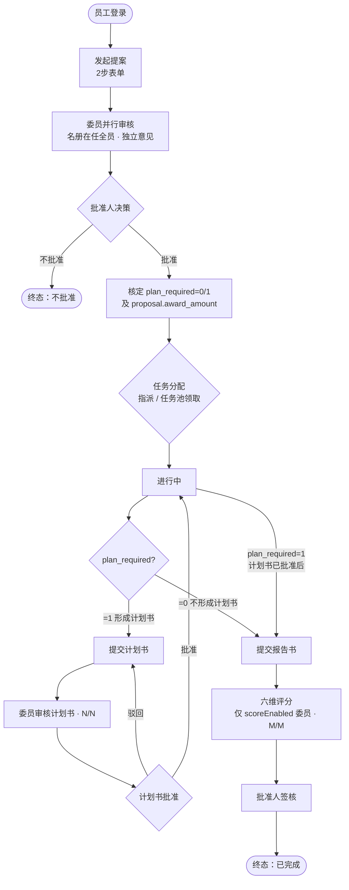
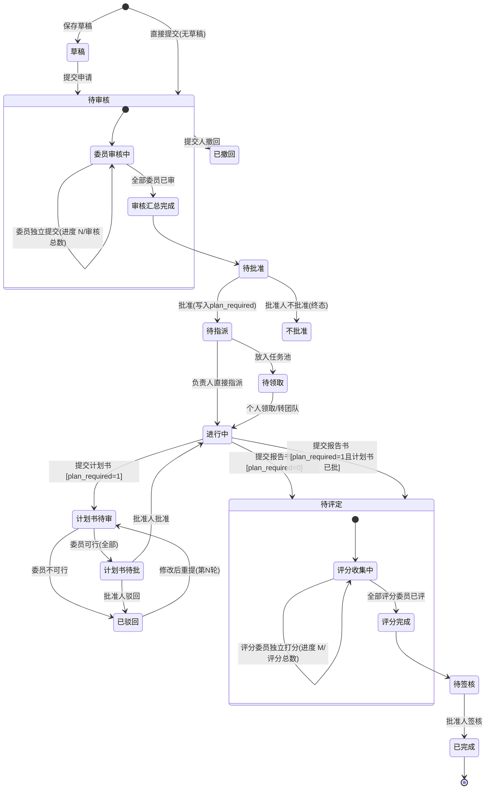
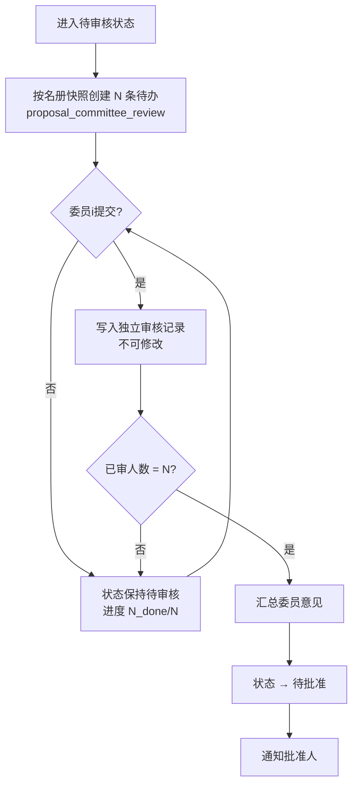
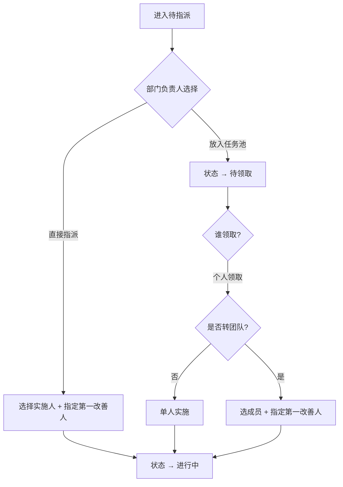
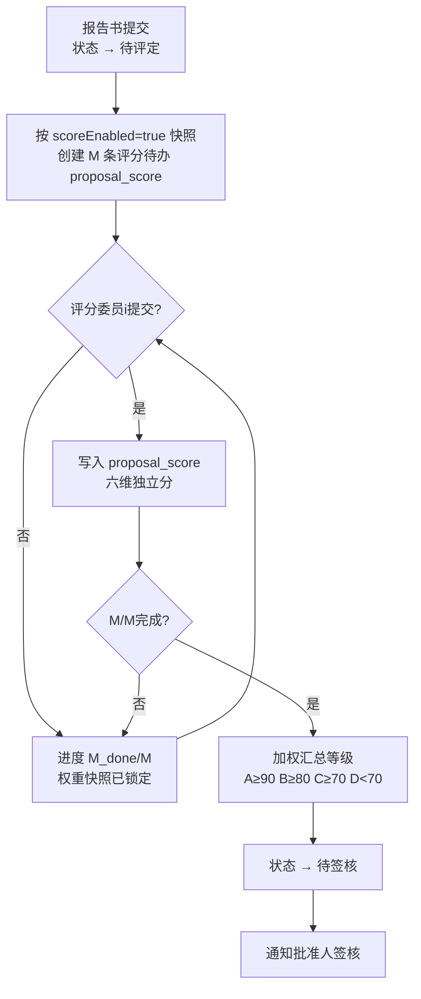
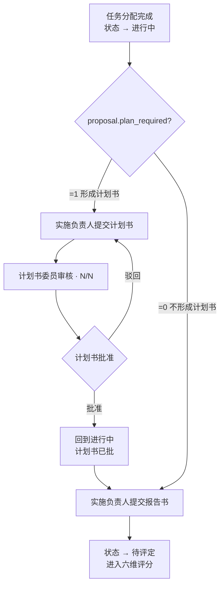

# 提案改善系统 — 实施规划文档

> **文档版本**：V1.8  
> **创建日期**：2026-08-26  
> **最后修订**：2026-08-28  
> **决策结论**：确定走 **完整 PRD 路线**（对齐小程序 V4.3 + 管理端 `#/improve/*` 原型）  
> **资料目录**：`docs/improve/`（见 [README.md](./README.md)）  
> **小程序原型**：`docs/improve/prototype/improveSys.html`  
> **管理端原型**：`docs/improve/prototype/index.html`（仅关注「提案改善」菜单）  
> **原型（内网）**：http://192.168.123.92:9999/improveSys.html

---

## 目录

1. [项目概述](#1-项目概述)
2. [关键设计决策](#2-关键设计决策)
3. [原型功能梳理](#3-原型功能梳理)
4. [状态机与业务规则](#4-状态机与业务规则)
5. [角色与权限矩阵](#5-角色与权限矩阵)
6. [逐页字段清单](#6-逐页字段清单)
7. [现状差距分析](#7-现状差距分析)
8. [技术架构](#8-技术架构)
9. [数据库设计](#9-数据库设计)
10. [后端模块结构](#10-后端模块结构)
11. [API 接口清单](#11-api-接口清单)
12. [分阶段实施计划](#12-分阶段实施计划)
13. [风险与待确认项](#13-风险与待确认项)
14. [附录](#14-附录)

---

## 1. 项目概述

### 1.1 系统定位

**提案改善系统（Kaizen Proposal System）** 是面向制造/生产类企业的内部持续改善提案管理平台。员工通过移动端（uni-app）提交改善建议，经委员会并行审核、批准人决策、部门任务分配、计划书/报告书流转、六维评分后签核结案，并支持提案奖励核定与统计看板。

- **品牌**：SPEX · BRAND GLASS  
- **口号**：人人参与改善 · 点滴汇聚效益  
- **原型版本**：V4.3  
- **终端形态**：移动端（JeecgUniapp / uni-app）+ 管理端（jeecgboot-vue3）

### 1.2 核心业务流程

> 跨角色操作顺序，用 **flowchart** 表达；`proposal.status` 合法迁移见 [4.2 状态流转图](#42-状态流转图)。**计划书仅在 `plan_required=1` 时提交**；`plan_required` 由批准人 6.4 核定写入。



### 1.3 文档用途

本文档汇总原型探索结论、与现有 JeecgBoot 代码库的差距分析、技术选型决策及分阶段实施计划，供后续开发、评审与复盘使用。

---

## 2. 关键设计决策

| 决策点 | 选定方案 | 理由 |
|--------|----------|------|
| **业务范围** | 完整 PRD（23 页原型全量） | 用户确认，对齐 V4.3 原型 |
| **审批流引擎** | 自研轻量状态机 | 原型要求委员**并行独立**审核，与 Flowable 串行审批模型不匹配；本仓库未集成 BPM 模块 |
| **小程序框架** | JeecgUniapp（uni-app） | 与 JeecgBoot 3.9.3 配套 |
| **计划书** | **仅 `plan_required=1` 时提交** | 批准人 6.4 核定写入 `proposal.plan_required`；=0 跳过计划书全链路，**仍须先任务分配**，再提交报告书 |
| **委员会** | **动态名册**（管理端可增删） | 对齐管理端「提案配置 → 委员会成员」；人数不固定 |
| **评分** | 名册子集 + **`scoreEnabled` 开关** | 审核 = 在任全员；评分 = `scoreEnabled=true` 且有 `seatNo` 的成员；不设独立评分角色 |
| **配置 vs 角色** | **方案③：名册管业务，角色管粗权限** | 待办/人数/席位只读配置表；`sys_role` 可选作菜单权限；**不加 `role_id`**；加成员**不强制**双写角色 |
| **部门负责人** | **按改善部门配置** | 对齐管理端「改善部门负责人」Tab；挂 `sys_depart.id`；选部门自动带出，未配置则阻断 |
| **批准人** | 全局配置（通常 1 人） | 对齐管理端「批准人」Tab |
| **评分维度** | 可配置 CRUD（权重合计 ≤100%） | 对齐管理端「评分维度」Tab；提交评分时锁权重快照 |
| **提案编号** | `YYYYMMDD` + 4 位流水 | 全流程共用同一编号 |
| **登录方式** | 工号+密码（`username` = `workNo`） | 复用 Jeecg `POST /sys/login`；导入时 `username = workNo` |
| **鉴权** | 管理端与移动端**共用同一套 JWT** | 复用 Jeecg Shiro + JWT，不按端拆分 token |
| **用户体系** | 复用 `sys_user` | 不自建 `proposal_user` |
| **角色权限** | `sys_role` 粗权限 + 配置表业务名册 | 委员/批准人互斥仍可校验；业务推送不以角色为准 |
| **组织架构** | 复用 `sys_depart` 树形结构 | 中心 > 部门 > 组别均以父子节点存储；`org_type` 区分层级 |
| **人员管理** | Jeecg 用户/部门管理 + HR Excel 导入 | 暂不对接 HR 系统接口 |
| **离职处理** | `sys_user.status = 2`（冻结） | 保留历史姓名；无线上强制交接；新建流程校验在职 |
| **API 前缀** | `/proposal/**`（共用业务）+ `/proposal/admin/**`（管理端）+ `/proposal/app/**`（小程序）+ `/sys/**` | 同一 JWT；Service 共用，Controller 按端分包 |
| **管理端** | jeecgboot-vue3：提案管理 + 提案配置 | 对齐 `index.html` 中「提案改善」菜单；忽略项目管理/智能车间等无关模块 |

### 2.1 身份与组织体系架构

**复用 JeecgBoot 平台能力**，提案模块只维护业务流程表：

```
┌──────────────────────────────────────────────────────────────┐
│  JeecgBoot 平台（sys_*，管理端 + 移动端共用）                    │
│                                                              │
│  sys_depart / sys_user / sys_user_depart                     │
│  sys_role / sys_user_role  ← 粗权限（菜单等），非业务名册来源    │
│  登录：POST /sys/login → 同一套 JWT                             │
└──────────────────────────┬───────────────────────────────────┘
                           │ 外键 sys_user.id / sys_depart.id
                           ▼
┌──────────────────────────────────────────────────────────────┐
│  提案配置域（管理端「提案配置」维护，业务名册来源）                │
│  proposal_dept_leader / proposal_committee_member            │
│  proposal_approver / proposal_score_dimension                │
└──────────────────────────┬───────────────────────────────────┘
                           │ 提交时快照 → 流程待办
                           ▼
┌──────────────────────────────────────────────────────────────┐
│  提案业务域（proposal_* 流程表）                                 │
│  proposal / application / plan / report / task / score ...   │
└──────────────────────────────────────────────────────────────┘
```

**关键原则：**

- **不建** `proposal_user`、`proposal_role`、`proposal_dept`、`proposal_group`
- **`proposal_committee_member` 不加 `role_id`**；只存 `user_id`（→ `sys_user.id`）
- **方案③**：谁审、谁评、部门负责人、批准人 → **只读配置表**；`sys_role` 可选作粗权限，加名册时**不强制**双写 `sys_user_role`
- 导入员工时：**`username = workNo`**，`work_no` 保持工号唯一
- 管理端与移动端共用 **同一 JWT**
- 纯业务员工**不分配**管理端菜单权限
- **本期不做微信授权登录**，不设计 `openid` 等字段

**提案业务角色（`sys_role.role_code`，粗权限可选）：**

| role_code | 名称 | 用途（方案③） |
|-----------|------|---------------|
| `proposal_committee` | 提案-委员 | 可选：小程序委员相关菜单；**待办不以本角色为准** |
| `proposal_approver` | 提案-批准人 | 可选：批准相关菜单；**实际批准人读配置表** |
| `proposal_dept_leader` | 提案-部门负责人 | 可选：任务指派菜单；**实际负责人读按部门配置** |
| `proposal_admin` | 提案-管理员 | 管理端「提案配置 / 提案管理」菜单 |

---

## 3. 原型功能梳理

原型左侧导航共 **5 大模块、23 个页面**（提案详情页为占位空壳）。

### 3.1 入口与主导航（6 页）

| # | 页面 | 功能摘要 |
|---|------|----------|
| 01 | 登录 | 工号+密码登录（`username` = 工号） |
| 02 | 首页 | 待办/进行中/已结案统计、角色待办、最新动态 |
| 03 | 提案列表 | Tab 筛选 + 搜索 + 状态徽章 + 审核进度 |
| 04 | 我的待办 | 按角色展示不同类型待办 |
| 05 | 消息（铃铛） | 催/批/驳/评 四类通知 |
| 06 | 我的 | 个人统计、入口菜单 |

### 3.2 主流程表单（3 页）

| # | 页面 | 功能摘要 |
|---|------|----------|
| 01 | 发起提案（2 步） | 内容填写 → 确认提交 |
| 02 | 计划书（含驳回） | 4 段内容 + 计划日期 + 多轮驳回重提 |
| 03 | 报告书 | 4 段内容 + 参与人员 + 评分矩阵说明 |

### 3.3 任务分配（3 页）

| # | 页面 | 功能摘要 |
|---|------|----------|
| 01 | 任务指派 | 部门负责人指派实施人 / 放入任务池 |
| 02 | 部门任务池 | 个人领取 |
| 03 | 领取转团队 | 领取后添加成员、指定实施负责人 |

### 3.4 审核与评分（10 页）

| # | 页面 | 功能摘要 |
|---|------|----------|
| 01 | 申请委员待办 | 委员并行审核申请单 |
| 02 | 申请委员审核 | 采用/不采用 + 计划书建议 + 奖励建议 |
| 03 | 计划书委员待办 | 计划书可行性审核待办 |
| 04 | 计划书委员审核 | 可行/不可行 + 审核意见 |
| 05 | 批准人待办 | 申请批准 / 计划书批准 / 报告书签核 |
| 06 | 申请批准 | 批准/不批准（终态）+ 核定奖励 |
| 07 | 计划书批准 | 批准/驳回（可退回修改） |
| 08 | 六维评分 | 5 位委员独立打分 |
| 09 | 报告书签核 | 批准人确认签核结案 |
| 10 | 提案详情 | **原型空壳，待设计** |

### 3.5 统计（1 页）

| # | 页面 | 功能摘要 |
|---|------|----------|
| 01 | 统计看板 | KPI + 月度趋势 + 性质分布 + 部门排行 |

### 3.6 底部 Tab 导航

首页 / 待办（角标）/ 提案 / 我的

---

## 4. 状态机与业务规则

### 4.1 状态枚举

| 状态码（建议） | 显示名 | 说明 |
|---------------|--------|------|
| `DRAFT` | 草稿 | 未提交（可选） |
| `PENDING_REVIEW` | 待审核 | 申请已提交，委员审核中 |
| `PENDING_APPROVAL` | 待批准 | 委员意见汇总，等批准人 |
| `REJECTED_FINAL` | 不批准 | 申请阶段终态，不可退回 |
| `WITHDRAWN` | 已撤回 | 提交人主动撤回 |
| `PENDING_ASSIGN` | 待指派 | 已批准，部门负责人需指派 |
| `PENDING_CLAIM` | 待领取 | 已放入部门任务池 |
| `IN_PROGRESS` | 进行中 | 已指派/领取，实施中 |
| `PLAN_PENDING_REVIEW` | 计划书待审 | 计划书提交，委员审核中 |
| `PLAN_PENDING_APPROVAL` | 计划书待批 | 委员可行，等批准人 |
| `PLAN_REJECTED` | 已驳回 | 计划书被驳回，可修改重提 |
| `PENDING_EVALUATION` | 待评定 | 报告书已提交，等待评分 |
| `PENDING_SIGNOFF` | 待签核 | 评分完成，等批准人签核 |
| `COMPLETED` | 已完成 | 签核归档 |

### 4.2 状态流转图

> 用 **stateDiagram-v2** 表达 `proposal.status` 枚举与合法迁移。节点 → `ProposalStatusEnum`；箭头事件 → `ProposalStateMachine` 动作；复合状态内部的多人并行逻辑见 [4.4 子流程图](#44-子流程图)。**`plan_required` 在批准人决策时写入主表**，控制计划书分支（见 [4.4.4](#444-plan_required-分支任务分配后)）。



### 4.3 关键业务规则

| 环节 | 规则 |
|------|------|
| 登录 | 复用 `POST /sys/login`，`username` = `workNo`；`status=1` 正常才可登录 |
| 离职 | 后台将 `sys_user.status` 设为冻结（2）；保留 `realname`；不做线上强制交接；新建流程校验在职 |
| 申请审核 | 在任委员会成员**并行独立**审核（人数 = 名册快照）；提交后待审核阶段可撤回 |
| 申请批准 | **不批准为终态，不可退回**；批准时写入 **`proposal.plan_required`**（0/1）及 **`proposal.award_amount`** |
| 任务分配 | **plan_required=0/1 均须先完成**（指派或任务池领取）；多人必须指定**实施负责人（第一改善人）**；负责人来自 **`proposal_dept_leader` 按改善部门配置** |
| 计划书 | **仅 `plan_required=1` 时**可提交；=0 时禁止进入 `PLAN_*` 状态，不展示计划书待办/入口 |
| 计划书/报告书 | 实施负责人**统一填写，仅一份** |
| 计划书审核 | 与申请审核**意见独立记录**；支持多轮驳回重提；审核人 = 名册在任全员快照 |
| 计划书批准 | 可驳回退回实施负责人修改 |
| 评分 | 仅 **`scoreEnabled=true`** 的委员并行打分（可少于审核人数）；权重快照；等级 A≥90 / B≥80 / C≥70 / D<70 |
| 签核 | 批准人签核后系统自动填写结案日期；批准人来自配置表 |
| 审核/评分进度 | 申请/计划书审核 `N/审核总数`；评分 `M/评分总数`（**不再写死 5/5**） |
| 名册变更 | 移除委员只影响**新提案**；在途单以提交时快照为准 |

### 4.4 子流程图

> 以下用 **flowchart** 描述状态机**内部**的多人并行汇总、分支选择逻辑；主状态迁移见 [4.2](#42-状态流转图)。

#### 4.4.1 委员并行审核（申请 / 计划书）

申请阶段对应 `PENDING_REVIEW` → `PENDING_APPROVAL`；计划书阶段对应 `PLAN_PENDING_REVIEW` → `PLAN_PENDING_APPROVAL` / `PLAN_REJECTED`，汇总模式相同。



#### 4.4.2 任务指派 / 任务池



#### 4.4.3 六维评分（`scoreEnabled` 子集）



#### 4.4.4 `plan_required` 分支（任务分配后）

> **已确认**：`plan_required=0/1` **均须先完成任务分配**（指派或任务池领取）进入 `进行中`，再按分支推进。`plan_required` 由批准人 6.4 写入 `proposal.plan_required`；委员 6.3 的「是否形成计划书」仅作参考。



**实现守卫（备忘，供状态机编码参考）：**

| 动作 | 前置条件 |
|------|----------|
| 提交计划书 | `plan_required=1` 且当前为 `进行中` |
| 提交报告书（跳过计划书） | `plan_required=0` 且当前为 `进行中` |
| 提交报告书（计划书路径） | `plan_required=1` 且计划书已批准 |
| 进入 `PLAN_*` 状态 | 仅当 `plan_required=1` |

### 4.5 改善性质枚举

- 安全改善（`SAFETY`）
- 品质改善（`QUALITY`）
- 效率改善（`EFFICIENCY`）
- 交付改善（`DELIVERY`）
- 成本改善（`COST`）

---

## 5. 角色与权限矩阵

### 5.1 角色与名册模型（方案③）

**业务待办来源 = 配置名册**；**Jeecg 角色 = 粗权限（可选）**。

| 层级 | 落点 | 职责 |
|------|------|------|
| 业务名册 | `proposal_committee_member` 等 | 谁审、谁评、部门负责人、批准人、维度权重 |
| 粗权限 | `sys_role` + `sys_user_role` | 菜单/接口粗粒度；加名册时**不强制**双写角色 |
| 禁止 | `proposal_committee_member.role_id` | **不建**指向 `sys_role` 的外键 |

**配置表驱动规则：**

| 配置 | 规则 |
|------|------|
| 委员会成员 | 管理端可自由添加/移除；在任全员参与申请审/计划书审 |
| `scoreEnabled` | 开关；`true` 分配 `seatNo` 参与评分；`false` 显示「不参与评分」 |
| 改善部门负责人 | **按改善部门**一行配置（`dept_id` → `leader_user_id`）；可为空，提交提案时校验 |
| 批准人 | 全局配置（通常 1 人） |

**`sys_role` 粗权限（可选）：**

| 角色码 | 名称 | 说明 |
|--------|------|------|
| — | 普通员工 | 无额外角色即可发起提案、领取任务 |
| `proposal_committee` | 委员 | 可选菜单权限；**待办读名册** |
| `proposal_approver` | 批准人 | 可选菜单权限；**实际批准人读配置** |
| `proposal_dept_leader` | 部门负责人 | 可选菜单权限；**实际负责人读按部门配置** |
| `proposal_admin` | 管理员 | 管理端提案配置/管理菜单 |

**业务属性（非全局角色）：**

- **实施负责人**：提案/Task 级属性，从在职 `sys_user` 中指派

**互斥规则（当前阶段）：**

| 规则 | 说明 |
|------|------|
| 委员 ↔ 批准人 | **互斥**（若使用角色双写或手工赋角色时校验；名册侧也可校验同一人不同时为批准人） |
| 部门负责人 ↔ 其他 | **不互斥** |
| 一人多角色 | **允许**（除委员+批准人组合外） |

### 5.2 原型角色视角

原型支持 5 种角色视角切换演示：

| 角色 | 示例用户 | 部门/职位 | 主要职责 |
|------|----------|-----------|----------|
| 普通员工 | 张伟 | 生产一部 · 注塑组 · 产线工程师 | 发起提案、关注进度、任务池领取 |
| 委员 | 李静 | 品质部 · 体系组 | 申请审核、计划书审核、六维评分 |
| 批准人 | 王建国 | 总经理办公室 | 申请批准、计划书批准、报告书签核 |
| 部门负责人 | 赵强 | 品质部 · 管理组 | 任务指派、放入任务池 |
| 实施负责人 | 张伟 | 生产一部 · 注塑组 | 填写计划书/报告书、转团队 |

### 5.3 能力矩阵

| 能力 | 普通员工 | 委员 | 批准人 | 部门负责人 | 实施负责人 |
|------|:-------:|:----:|:-----:|:---------:|:---------:|
| 发起提案 | ✓ | ✓ | ✓ | ✓ | ✓ |
| 申请委员审核 | — | ✓ | — | — | — |
| 申请批准 | — | — | ✓ | — | — |
| 任务指派 | — | — | — | ✓ | — |
| 部门任务池领取 | ✓ | — | — | — | ✓ |
| 转团队 | — | — | — | — | ✓ |
| 填写计划书/报告书 | — | — | — | — | ✓ |
| 计划书委员审核 | — | ✓ | — | — | — |
| 计划书批准 | — | — | ✓ | — | — |
| 六维评分 | — | ✓ | — | — | — |
| 报告书签核 | — | — | ✓ | — | — |
| 统计看板 | ✓ | ✓ | ✓ | ✓ | ✓ |

---

## 6. 逐页字段清单

### 6.1 登录

> 原型页面为微信授权样式，**本期实现工号+密码**，复用 Jeecg `POST /sys/login`。

| 字段/控件 | 类型 | 规则 |
|----------|------|------|
| 工号 | 文本 | `sys_user.username`（导入时 = `work_no`） |
| 密码 | 密码 | 后台设定或重置 |
| 登录 | 按钮 | `POST /sys/login`，签发 Jeecg JWT（与管理端共用） |

### 6.2 发起提案

**Step 1 — 内容填写**

| 区块 | 字段 | 类型 | 必填 |
|------|------|------|------|
| A 提案人信息 | 姓名/工号/职位/部门·组别 | 只读 | 自动带出 |
| A | 邮箱 | 文本 | 是 |
| B 提案内容 | 提案名称 | 文本 ≤50字 | 是 |
| B | 目前状况及问题 | 多行 | 是 |
| B | 改善意见（含实施设想） | 多行 | 是 |
| B | 改善性质 | 多选标签 | 是 |
| C 改善部门 | 改善部门 | 下拉 | 是 |
| C | 部门负责人 | 只读 | 选部门后自动带出 |
| D 现场图片 | 图片上传 | 文件 | 否，最多 4 张 |

**Step 2 — 确认提交**：摘要展示 + `提交后进入委员会并行审核；待审核中可撤回`

### 6.3 申请委员审核

| 字段 | 类型 | 选项 |
|------|------|------|
| 审核结论 | 单选 | 采用 / 不采用 |
| 是否形成改善计划书 | 单选 | 形成 / 不形成 |
| 提案奖额度（元） | 数字 | 采用时建议 |
| 综合评价 | 多行文本 | — |

### 6.4 申请批准

| 字段 | 类型 | 说明 |
|------|------|------|
| 委员意见汇总 | 只读 | N/审核总数 已完成 |
| 批准决策 | 单选 | 批准 / 不批准（终态） |
| 核定是否形成改善计划书 | 单选 | 形成 / 不形成；**写入 `proposal.plan_required`（0/1），驱动后续是否走计划书链路** |
| 核定提案奖金额（元） | 数字 | 以委员会建议为基础；**写入 `proposal.award_amount`，为最终生效金额** |

### 6.5 任务指派

| 字段 | 类型 | 说明 |
|------|------|------|
| 分配模式 | Tab | 指派 / 任务池领取 |
| 选择实施人 | 多选 | 改善部门成员 |
| 指定实施负责人 | 单选 | 第一改善人 |
| 团队类型 | 只读 | 自动计算 |

### 6.6 计划书

| 字段 | 必填 |
|------|------|
| 01 现状描述（问题） | 是 |
| 02 改善对策及成本 | 是 |
| 03 预估效益评估 | 是 |
| 04 实施计划 | 是 |
| 计划开始日期 | 是 |
| 计划完成日期 | 是 |

### 6.7 计划书委员审核

| 字段 | 选项 |
|------|------|
| 可行性 | 可行 / 不可行 |
| 审核意见 | 多行文本 |

### 6.8 计划书批准

| 字段 | 选项 |
|------|------|
| 批准决策 | 批准 / 驳回（退回实施负责人修改） |
| 审核意见 | 多行文本 |

### 6.9 报告书

| 区块 | 字段 |
|------|------|
| 头信息 | 提案名称/编号/填写日期/立案日期/结案日期 |
| P 参与人员 | 提案人/第一改善人/改善人（工号·职位·部门） |
| A | 改善性质（带出可改） |
| 01~04 | 现状描述 / 改善对策及成本 / 实施效果及推广 / 效益评估 |

### 6.10 六维评分

> 由委员会名册中 **`scoreEnabled=true`** 的成员并行独立打分（人数 M 可变，可少于审核委员数）。

| 维度 | 权重（默认，可配置） | dimCode（管理端原型） |
|------|----------------------|----------------------|
| 有形绩效 | 30% | `tangible` |
| 无形绩效 | 10% | `intangible` |
| 难易度 | 20% | `difficulty` |
| 思考性 | 10% | `thinking` |
| 推广性 | 15% | `spread` |
| 创新性 | 15% | `innovation` |

等级：A≥90 / B≥80 / C≥70 / D<70；启用维度权重合计 **≤100%**。

### 6.11 报告书签核

- 评定结果：总分、等级、核定提案奖金额
- 各委员评分明细
- 签核人、签核时间、结案日期（系统自动）

### 6.12 统计看板

- Tab：总览 / 个人成绩 / 排行
- 时间：本年 / 本季 / 本月
- KPI：提案总数、采用率、进行中、累计提案奖
- 图表：月度提案量、改善性质分布、部门排行

---

## 7. 现状差距分析

> 调研日期：2026-08-26  
> 调研范围：`code` 仓库（jeecg-boot + jeecgboot-vue3）

### 7.1 当前仓库现状

| 层级 | 技术 | 状态 |
|------|------|------|
| 后端 | JeecgBoot 3.9.3 / Spring Boot 4.1 / JDK 17 | 标准底座，**无提案业务** |
| 管理端 | Vue 3.5 + Vite + Ant Design Vue 4 | 标准系统管理，**无提案页面** |
| 小程序 | — | **不存在** |
| 数据库 | jeecgboot-mysql 官方脚本 | **无 proposal 相关表** |
| 工作流 | Flowable | **未集成** |
| 业务关键词 | 提案/改善/计划书/委员/六维评分 | **0 命中** |

### 7.2 可复用平台能力

| 能力 | 位置 | 用途 |
|------|------|------|
| 数据字典 | `sys_dict` | 改善性质、部分状态枚举（业务字典也可用 `proposal_config`） |
| 文件上传/OSS | `CommonController` | 现场图片、附件 |
| 消息通知 | `SysAnnouncement` | 审核结果、待办提醒（目标 `sys_user`） |
| 用户/部门/角色管理 | `jeecg-module-system` | 复用 `/sys/user`、`/sys/depart`、`/sys/role` |
| Online 低代码 | `jeecg-online` jar | 管理端部分配置页快速搭建 |
| 流程演示参考 | `JoaDemo` | `bpmStatus` 集成模式参考 |
| 登录鉴权 | `LoginController` + Shiro + JWT | 管理端与移动端共用 |

### 7.3 需从零开发

| 模块 | 优先级 |
|------|--------|
| `jeecg-module-spex-inside` 模块（含 proposal 业务） | P0 |
| 提案业务角色初始化（`sys_role`） | P0 |
| 登录（复用 `/sys/login`，`username=workNo`） | P0 |
| HR Excel 导入适配（用户+部门树） | P0 |
| 提案主表 + 申请书 + 状态机 | P0 |
| 委员并行审核 | P0 |
| 批准人决策（申请/计划书/签核） | P0 |
| 任务分配（指派/任务池/转团队） | P1 |
| 计划书（含多轮驳回） | P1 |
| 报告书 | P1 |
| 六维评分 | P1 |
| 统计看板 | P2 |
| 移动端（23 页） | P0~P2 分阶段 |
| 管理端配置页 | P2 |
| 提案详情页（时间线） | P2 |

---

## 8. 技术架构

### 8.1 整体架构

```
┌─────────────────┐     ┌─────────────────┐
│  移动端          │     │  管理端 Vue3     │
│  (JeecgUniapp)  │     │  (jeecgboot-vue3)│
└────────┬────────┘     └────────┬────────┘
         │  POST /sys/login      │  POST /sys/login
         │  同一套 JWT            │  同一套 JWT
         └───────────┬───────────┘
                     ▼
         ┌───────────────────────────────┐
         │  jeecg-module-system（复用）    │
         │  sys_user / sys_depart /       │
         │  sys_role / sys_user_role      │
         └───────────────┬───────────────┘
                         ▼
         ┌───────────────────────────────┐
         │  jeecg-module-spex-inside（SPEX 内部模块）  │
         │  /proposal/**      共用业务      │
         │  /proposal/admin/** 管理端专有   │
         │  /proposal/app/**   小程序专有   │
         │  外键 → sys_user.id             │
         │         sys_depart.id           │
         └───────────────┬───────────────┘
                         ▼
                   MySQL proposal_* 表
```

### 8.2 登录认证方案

管理端与移动端**共用 Jeecg 标准登录与 JWT**：

| 项目 | 方案 |
|------|------|
| 登录接口 | `POST /sys/login` |
| 登录账号 | `username`（导入时 **= `workNo`**） |
| 工号字段 | `sys_user.work_no`（唯一） |
| 密码 | `sys_user.password`（Jeecg 加密规则） |
| Token | Jeecg JWT，请求头 `X-Access-Token` |
| 用户信息 | `GET /sys/user/getUserInfo` |
| 离职禁用 | `sys_user.status = 2`（冻结），无法登录 |

**权限隔离：**

- 业务员工：仅分配 `proposal_*` 业务角色，不分配管理端菜单权限
- 管理员：分配系统管理角色 + 可选 `proposal_admin`
- 移动端调用 `/proposal/**`、`/proposal/app/**` 时校验业务角色（`role_code`）
- 管理端 `/proposal/admin/**` 额外校验菜单权限（`sys_permission`）

### 8.3 技术栈

| 层级 | 技术 | 版本 |
|------|------|------|
| 后端平台 | JeecgBoot | 3.9.3 |
| Spring Boot | | 4.1.0 |
| JDK | | 17 |
| ORM | MyBatis-Plus | 3.5.16 |
| 认证 | Shiro + JWT | 管理端与移动端共用 |
| 管理端 | Vue3 + Vite + Ant Design Vue | 3.9.3 |
| 移动端 | JeecgUniapp (uni-app) | v3.0.0（本仓库 `jeecg-uniapp/`，二次开发，不同步官方） |
| 数据库 | MySQL | 8.0 |

### 8.4 状态机实现方案

采用 **自研轻量状态机**，不引入 Flowable：

- `ProposalStateMachine` 服务：校验当前状态 → 执行动作 → 流转下一状态
- `proposal_status_log` 表：记录每次状态变更（操作人、时间、备注）
- 委员审核：提交时按名册快照预生成待办，全部完成后触发汇总
- 委员评分：按 `score_enabled` 子集快照预生成待办，全部完成后触发汇总
- 并发控制：乐观锁 `version` 字段防止重复提交

---

## 9. 数据库设计

### 9.1 表清单

**复用 Jeecg 平台表（不新建）：**

| 表名 | 用途 |
|------|------|
| `sys_user` | 用户（`username` = `work_no`，`realname`，`password`，`status`） |
| `sys_depart` | 组织架构树（中心 > 部门 > 组别，`parent_id` 父子关系） |
| `sys_user_depart` | 用户与部门/组别关联 |
| `sys_role` | 角色（含 `proposal_committee` 等提案业务角色） |
| `sys_user_role` | 用户角色关联 |

**提案业务表（新建）：**

| 表名 | 说明 | Phase |
|------|------|-------|
| `proposal` | 提案主表 | 1 |
| `proposal_application` | 申请书内容 | 1 |
| `proposal_attachment` | 附件（现场图片等） | 1 |
| `proposal_status_log` | 状态变更日志 | 1 |
| `proposal_dept_leader` | 改善部门负责人配置（按部门） | 1~2 |
| `proposal_committee_member` | 委员会名册（含 `score_enabled` / `seat_no`） | 1~2 |
| `proposal_approver` | 批准人配置（全局） | 1~2 |
| `proposal_score_dimension` | 评分维度配置 | 1~2 |
| `proposal_committee_review` | 委员审核记录（申请阶段，提交时快照） | 2 |
| `proposal_approval` | 批准人决策记录 | 2 |
| `proposal_task` | 任务分配（指派/领取/团队） | 3 |
| `proposal_task_member` | 实施团队成员 | 3 |
| `proposal_plan` | 计划书 | 3 |
| `proposal_plan_review` | 计划书委员审核 | 3 |
| `proposal_report` | 报告书 | 4 |
| `proposal_score` | 六维评分明细（按评分委员） | 4 |
| `proposal_signoff` | 签核记录 | 4 |

> **已废弃（不建表）：** `proposal_user`、`proposal_role`、`proposal_user_role`、`proposal_dept`、`proposal_group`、固定人数用的 `proposal_config.committee_size`  
> **说明：** 通用 KV 配置若仍需要，可用 `proposal_config`，但委员/负责人/批准人/维度**不以** KV 替代上述专用表。

### 9.2 组织架构（`sys_depart`）

部门与组别统一存入 **`sys_depart` 树形结构**，通过 `parent_id` 表达父子关系：

```text
公司根节点
 └── 职能科              ← 中心（org_type = CENTER）
      └── 自动化开发部     ← 部门（org_type = DEPT）
           ├── MES开发     ← 组别（org_type = GROUP）
           ├── 机械设计
           └── 电气控制
```

| 字段 | 说明 |
|------|------|
| `parent_id` | 父节点 ID |
| `depart_name` | 节点名称 |
| `org_code` | 机构编码（层级编码，Jeecg 自带） |
| `org_type` | 自定义区分：`CENTER` / `DEPT` / `GROUP` |
| `org_category` | Jeecg 内置类别（默认 `2` 组织机构） |
| `status` | 1 启用 / 0 停用 |

员工挂在**最细一级**（通常为组别），通过 `sys_user_depart` 关联。展示格式：`{父部门} · {组别}`。

### 9.3 用户与角色（`sys_user` / `sys_role`）

| 字段 | 说明 |
|------|------|
| `sys_user.username` | 登录账号，**导入时 = `work_no`** |
| `sys_user.work_no` | 工号，唯一 |
| `sys_user.realname` | 姓名 |
| `sys_user.password` | 密码（Jeecg 加密） |
| `sys_user.status` | 1 正常 / 2 冻结（离职） |

角色通过 `sys_user_role` 分配时，若赋 `proposal_committee` / `proposal_approver`，仍建议校验互斥。  
**业务待办不以角色为准**；以配置名册为准（方案③）。

### 9.4 HR Excel 导入映射

| HR 列 | JeecgBoot 落点 |
|-------|----------------|
| 中心 | `sys_depart` 节点（`org_type=CENTER`） |
| 部门 | `sys_depart` 子节点（`org_type=DEPT`） |
| 组别 | `sys_depart` 子节点（`org_type=GROUP`） |
| 工号 | `sys_user.work_no`，且 **`username = work_no`** |
| 姓名 | `sys_user.realname` |
| 岗位 | `sys_user.position_type` |

```text
1. 解析「中心/部门/组别」→ 逐级创建 sys_depart 树节点
2. 解析「工号+姓名+岗位」→ 创建/更新 sys_user（username = workNo）
3. 关联 sys_user_depart → 挂在组别节点
4. 角色分配 → 管理端「角色管理」单独配置
```

### 9.5 人员管理与离职处理

复用 Jeecg **用户管理 / 部门管理 / 角色管理**，不单独建提案人员表。

| 功能 | Jeecg 能力 |
|------|-----------|
| 用户 CRUD / 导入 | 系统管理 → 用户管理 |
| 部门树维护 | 系统管理 → 部门管理 |
| 角色分配 | 角色管理（扩展委员/批准人互斥校验） |
| 标记离职 | `sys_user.status = 2`（冻结） |

```text
离职：status = 2，realname 保留，无法登录
新建流程：校验 sys_user.status == 1
不做线上强制交接（线下代处理后管理员冻结账号）
```

### 9.6 提案业务表

#### `proposal` — 提案主表

| 字段 | 类型 | 说明 |
|------|------|------|
| id | varchar(36) | PK |
| proposal_no | varchar(20) | 编号 YYYYMMDD+4位流水，唯一 |
| title | varchar(100) | 提案名称 |
| status | varchar(32) | 状态枚举 |
| improvement_types | varchar(200) | 改善性质 JSON 数组 |
| dept_id | varchar(36) | 改善部门 → `sys_depart.id` |
| dept_leader_id | varchar(36) | 部门负责人 → `sys_user.id` |
| proposer_id | varchar(36) | 提案人 → `sys_user.id` |
| implement_leader_id | varchar(36) | 实施负责人 → `sys_user.id` |
| team_type | varchar(16) | PERSONAL / TEAM |
| plan_required | tinyint | 是否形成计划书 |
| award_amount | decimal(10,2) | 核定提案奖金额 |
| plan_round | int | 计划书当前轮次 |
| review_progress | varchar(16) | 审核进度如 `3/7`（分母为快照审核人数） |
| score_total | decimal(5,1) | 加权总分 |
| score_grade | char(1) | A/B/C/D |
| filed_date | date | 立案日期 |
| closed_date | date | 结案日期 |
| version | int | 乐观锁 |
| create_by / create_time | | |
| update_by / update_time | | |
| del_flag | tinyint | 逻辑删除 |

#### `proposal_application` — 申请书

| 字段 | 类型 | 说明 |
|------|------|------|
| id | varchar(36) | PK |
| proposal_id | varchar(36) | FK |
| current_situation | text | 目前状况及问题 |
| improvement_suggestion | text | 改善意见 |
| email | varchar(100) | 通知邮箱 |
| submit_time | datetime | 提交时间 |

#### `proposal_dept_leader` — 改善部门负责人配置

| 字段 | 类型 | 说明 |
|------|------|------|
| id | varchar(36) | PK |
| dept_id | varchar(36) | 改善部门 → `sys_depart.id`，唯一 |
| leader_user_id | varchar(36) | 负责人 → `sys_user.id`，可空（未配置） |
| update_by / update_time | | |

#### `proposal_committee_member` — 委员会名册

| 字段 | 类型 | 说明 |
|------|------|------|
| id | varchar(36) | PK |
| user_id | varchar(36) | → `sys_user.id`（**不加 `role_id`**） |
| score_enabled | tinyint(1) | 是否参与评分：1 是 / 0 否 |
| seat_no | int | 评分席位号；`score_enabled=0` 时为空 |
| status | varchar(16) | active / inactive |
| sort_no | int | 排序 |
| create_by / create_time / update_by / update_time | | |

> 在任（`status=active`）全员参与申请审/计划书审；仅 `score_enabled=1` 参与六维评分。

#### `proposal_approver` — 批准人配置

| 字段 | 类型 | 说明 |
|------|------|------|
| id | varchar(36) | PK |
| user_id | varchar(36) | → `sys_user.id`（全局通常 1 条有效） |
| status | varchar(16) | active / inactive |
| update_by / update_time | | |

#### `proposal_score_dimension` — 评分维度配置

| 字段 | 类型 | 说明 |
|------|------|------|
| id | varchar(36) | PK |
| dim_code | varchar(32) | 如 tangible / spread，唯一 |
| dim_name | varchar(64) | 显示名 |
| description | varchar(200) | 维度说明 |
| weight_pct | int | 权重百分比 |
| sort_no | int | 排序 |
| status | varchar(16) | active / disabled；启用权重合计 ≤100% |
| update_by / update_time | | |

#### `proposal_committee_review` — 委员审核（申请）

| 字段 | 类型 | 说明 |
|------|------|------|
| id | varchar(36) | PK |
| proposal_id | varchar(36) | FK |
| reviewer_id | varchar(36) | 委员 → `sys_user.id` |
| conclusion | varchar(16) | ADOPT / REJECT |
| plan_required | tinyint | 是否形成计划书（参考意见） |
| award_suggestion | decimal(10,2) | 建议奖励金额 |
| comment | text | 综合评价 |
| review_time | datetime | |

#### `proposal_plan` — 计划书

| 字段 | 类型 | 说明 |
|------|------|------|
| id | varchar(36) | PK |
| proposal_id | varchar(36) | FK |
| round | int | 轮次 |
| current_situation | text | 01 现状描述 |
| countermeasure_cost | text | 02 改善对策及成本 |
| benefit_evaluation | text | 03 预估效益评估 |
| implementation_plan | text | 04 实施计划 |
| plan_start_date | date | 计划开始 |
| plan_end_date | date | 计划完成 |
| status | varchar(32) | DRAFT / SUBMITTED / APPROVED / REJECTED |
| reject_reason | text | 驳回原因 |
| submit_time | datetime | |

#### `proposal_score` — 六维评分

| 字段 | 类型 | 说明 |
|------|------|------|
| id | varchar(36) | PK |
| proposal_id | varchar(36) | FK |
| scorer_id | varchar(36) | 评分委员 → `sys_user.id`（提交报告书时 `score_enabled` 快照） |
| seat_no | int | 评分席位号（快照） |
| tangible_performance | decimal(4,1) | 有形绩效 |
| intangible_performance | decimal(4,1) | 无形绩效 |
| difficulty | decimal(4,1) | 难易度 |
| thoughtfulness | decimal(4,1) | 思考性 |
| scalability | decimal(4,1) | 推广性（dimCode=`spread`） |
| innovation | decimal(4,1) | 创新性 |
| weighted_total | decimal(5,1) | 加权总分 |
| weight_snapshot | text | 权重配置快照 JSON |
| score_time | datetime | |

> **快照约定：** 提交申请 → 快照在任审核委员；提交报告书 → 快照 `score_enabled=true` 委员 + 锁定维度权重。

#### `proposal_config` — 通用 KV（可选）

| 字段 | 类型 | 说明 |
|------|------|------|
| config_key | varchar(64) | 其他杂项配置 |
| config_value | text | JSON |
| remark | varchar(200) | |

> 委员人数、部门负责人、批准人、评分维度**不再**用本表承载。

---

## 10. 后端模块结构

### 10.0 API 路径分层（已定稿）

| 层级 | URL 前缀 | Java 包 | 说明 |
|------|----------|---------|------|
| **共用** | `/proposal/**` | `controller/` | 生命周期、审核流、任务、计划书、报告书、评分等；两端均可调，差异在 VO/筛选 |
| **管理端** | `/proposal/admin/**` | `controller/admin/` | 后台列表维护、提案配置 CRUD、导出、运维统计等 |
| **小程序** | `/proposal/app/**` | `controller/app/` | 首页聚合、移动端待办/消息轻量接口等 |

> Service / Mapper / Entity **不分端**；仅 Controller（及 `vo/admin`、`vo/app`）按端拆分。

```
jeecg-boot/jeecg-boot-module/
└── jeecg-module-spex-inside/
    └── org/jeecg/modules/proposal/
    ├── pom.xml
    └── src/main/java/org/jeecg/modules/proposal/
        ├── controller/                    # 共用 → /proposal/**
        │   ├── ProposalController.java    # 创建/提交/详情/撤回（Phase 2+）
        │   ├── ProposalReviewController.java
        │   ├── ProposalTaskController.java
        │   ├── ProposalPlanController.java
        │   ├── ProposalReportController.java
        │   ├── ProposalScoreController.java
        │   └── ...
        ├── controller/admin/              # 管理端 → /proposal/admin/**
        │   ├── ProposalManageController.java   # /proposal/admin/manage/*
        │   ├── ProposalConfigController.java   # /proposal/admin/config/*
        │   └── ProposalStatsController.java    # /proposal/admin/stats/*（Phase 5）
        ├── controller/app/                # 小程序 → /proposal/app/**
        │   ├── ProposalHomeController.java     # /proposal/app/home（Phase 1）
        │   ├── ProposalTodoController.java     # /proposal/app/todo/*（Phase 2）
        │   └── ProposalStatsController.java    # /proposal/app/stats/*（Phase 5）
        ├── entity/
        │   ├── Proposal.java
        │   ├── ProposalApplication.java
        │   ├── ProposalCommitteeReview.java
        │   ├── ProposalPlan.java
        │   ├── ProposalReport.java
        │   ├── ProposalScore.java
        │   ├── ProposalTask.java
        │   └── ...
        ├── mapper/
        ├── service/
        │   ├── IProposalService.java
        │   ├── IProposalStateMachine.java
        │   ├── IProposalRoleValidateService.java  # 委员/批准人互斥校验
        │   ├── ICommitteeReviewService.java
        │   ├── IApprovalService.java
        │   ├── ITaskAssignService.java
        │   ├── IScoreService.java
        │   └── impl/
        ├── enums/
        │   ├── ProposalStatusEnum.java
        │   ├── ImprovementTypeEnum.java
        │   └── ReviewConclusionEnum.java
        ├── event/
        │   └── ProposalStatusChangeEvent.java  # 状态变更 → 消息通知
        └── vo/                               # 请求/响应 VO（可按 vo/admin、vo/app 分子包）
```

**Phase 1 已落地：** `controller/admin/ProposalManageController`、`ProposalConfigController`；`controller/app/` 占位待 Phase 2。

### 10.1 小程序端目录

```
jeecg-uniapp/  （本仓库 monorepo，基于官方 JeecgUniapp v3.0.0，不同步官方）
└── src/pages/proposal/
    ├── login/           # 登录（调用 /sys/login）
    ├── home/            # 首页
    ├── list/            # 提案列表
    ├── todo/            # 我的待办
    ├── message/         # 消息
    ├── mine/            # 我的
    ├── create/          # 发起提案
    ├── plan/            # 计划书
    ├── report/          # 报告书
    ├── task/            # 任务指派/任务池/转团队
    ├── review/          # 委员审核
    ├── approval/        # 批准人决策
    ├── score/           # 六维评分
    ├── signoff/         # 签核
    ├── detail/          # 提案详情
    └── stats/           # 统计看板
```

---

## 11. API 接口清单

> 路径与 §10.0 分层一致：**共用** `/proposal/**` · **管理端** `/proposal/admin/**` · **小程序** `/proposal/app/**`

### Phase 1 — 基础骨架

**登录与用户（复用 Jeecg）：**

| 方法 | 路径 | 说明 |
|------|------|------|
| POST | `/sys/login` | 工号+密码登录（`username` = `workNo`） |
| GET | `/sys/user/getUserInfo` | 当前用户信息（含部门、角色） |
| GET/POST/PUT | `/sys/user/**` | 用户管理（含导入、重置密码、冻结） |
| GET/POST/PUT | `/sys/depart/**` | 部门树管理 |
| GET/POST/PUT | `/sys/role/**` | 角色管理（含提案业务角色） |
| POST | `/sys/common/upload` | 图片上传（Jeecg 通用） |

**共用业务（`/proposal/**`，与管理端、小程序共用 JWT）：**

| 方法 | 路径 | 说明 |
|------|------|------|
| POST | `/proposal/create` | 创建提案（草稿） |
| PUT | `/proposal/{id}/submit` | 提交申请 |
| GET | `/proposal/list` | 提案列表（分页+筛选，按当前用户视角） |
| GET | `/proposal/{id}` | 提案详情 |
| POST | `/proposal/{id}/withdraw` | 撤回申请 |

**管理端专有（`/proposal/admin/**`）：**

| 方法 | 路径 | 说明 |
|------|------|------|
| GET | `/proposal/admin/manage/list` | 后台提案分页列表（全量维护） |
| POST | `/proposal/admin/manage/add` | 添加提案 |
| PUT | `/proposal/admin/manage/edit` | 编辑提案 |
| DELETE | `/proposal/admin/manage/delete` | 删除提案 |
| GET | `/proposal/admin/manage/queryById` | 提案详情（管理端） |
| GET | `/proposal/admin/config/deptLeader/list` | 改善部门负责人列表 |
| POST | `/proposal/admin/config/deptLeader/save` | 保存部门负责人 |
| GET | `/proposal/admin/config/committee/list` | 委员会成员列表 |
| POST | `/proposal/admin/config/committee/save` | 保存委员会成员 |
| GET | `/proposal/admin/config/approver/list` | 批准人列表 |
| POST | `/proposal/admin/config/approver/save` | 保存批准人 |
| GET | `/proposal/admin/config/scoreDimension/list` | 评分维度列表 |
| POST | `/proposal/admin/config/scoreDimension/save` | 保存评分维度 |

**小程序专有（`/proposal/app/**`）：**

| 方法 | 路径 | 说明 |
|------|------|------|
| GET | `/proposal/app/home` | 首页统计 + 待办摘要 + 动态 |

### Phase 2 — 审核流

**共用（`/proposal/**`）：**

| 方法 | 路径 | 说明 |
|------|------|------|
| GET | `/proposal/review/committee/pending` | 委员待审核列表 |
| POST | `/proposal/review/committee/{proposalId}` | 提交委员审核意见 |
| GET | `/proposal/approval/pending` | 批准人待办 |
| POST | `/proposal/approval/application/{proposalId}` | 申请批准决策 |

**小程序专有（`/proposal/app/**`）：**

| 方法 | 路径 | 说明 |
|------|------|------|
| GET | `/proposal/app/todo/list` | 我的待办 |
| GET | `/proposal/app/message/list` | 消息列表 |
| PUT | `/proposal/app/message/{id}/read` | 标记已读 |

### Phase 3 — 任务与计划书

**共用（`/proposal/**`）：**

| 方法 | 路径 | 说明 |
|------|------|------|
| GET | `/proposal/task/pending` | 待指派列表（部门负责人） |
| POST | `/proposal/task/assign` | 确认指派 |
| POST | `/proposal/task/pool` | 放入任务池 |
| GET | `/proposal/task/pool` | 部门任务池列表 |
| POST | `/proposal/task/claim/{proposalId}` | 个人领取 |
| POST | `/proposal/task/convert-team` | 转团队 |
| GET | `/proposal/plan/{proposalId}` | 获取计划书 |
| POST | `/proposal/plan/{proposalId}` | 保存/提交计划书 |
| GET | `/proposal/review/plan/pending` | 计划书委员待审 |
| POST | `/proposal/review/plan/{proposalId}` | 计划书委员审核 |
| POST | `/proposal/approval/plan/{proposalId}` | 计划书批准决策 |

### Phase 4 — 报告与评分

**共用（`/proposal/**`）：**

| 方法 | 路径 | 说明 |
|------|------|------|
| GET | `/proposal/report/{proposalId}` | 获取报告书 |
| POST | `/proposal/report/{proposalId}` | 保存/提交报告书 |
| GET | `/proposal/score/{proposalId}` | 获取评分（含权重配置） |
| POST | `/proposal/score/{proposalId}` | 提交评分 |
| POST | `/proposal/signoff/{proposalId}` | 批准人签核 |

### Phase 5 — 统计与管理端

**小程序专有（`/proposal/app/**`）：**

| 方法 | 路径 | 说明 |
|------|------|------|
| GET | `/proposal/app/stats/dashboard` | 统计看板 |
| GET | `/proposal/app/stats/personal` | 个人成绩 |
| GET | `/proposal/app/stats/ranking` | 排行榜 |

**管理端专有（`/proposal/admin/**`）：**

| 方法 | 路径 | 说明 |
|------|------|------|
| GET | `/proposal/admin/stats` | 管理端统计汇总 |

---

## 12. 分阶段实施计划

### Phase 1 — 基础骨架（预估 2~3 周）

**目标**：用户可以登录、发起提案、查看列表

| 任务 | 交付物 |
|------|--------|
| 新建 `jeecg-module-spex-inside` 模块 | Maven 模块 + `proposal` 业务包 + `controller/admin` + `controller/app` 分包 + pom 依赖 |
| 数据库建表 | 4 张配置表 + 4 张业务表 + 初始化 `sys_role` 提案角色（见 `proposal_init.sql` V1.1） |
| 管理端 API 骨架 | `/proposal/admin/manage/*`、`/proposal/admin/config/*` |
| 人员与组织 | 复用 Jeecg 用户/部门/角色管理；HR Excel 导入适配（`username=workNo`） |
| 登录 | 复用 `POST /sys/login`，管理端与移动端共用 JWT |
| 发起提案（2 步） | 创建/提交 API + 图片上传 + 在职状态校验 |
| 提案列表 + 首页 | 分页列表 + 统计卡片 |
| 小程序骨架 | JeecgUniapp 项目 + 登录/首页/列表/我的 4 页 |

**验收标准**：
- [ ] `POST /sys/login` 工号+密码登录成功（`username` = `workNo`）
- [ ] 管理端与移动端共用同一 JWT 可访问各自授权接口
- [ ] 后台可导入 HR Excel 并维护用户/部门树/初始密码
- [ ] 委员与批准人角色互斥校验生效
- [ ] 离职用户无法登录、无法进入新流程
- [ ] 可完成提案 2 步提交
- [ ] 提案列表按 Tab 筛选正常

### Phase 2 — 审核流（预估 2~3 周）

**目标**：委员审核 → 批准人决策 → 待办/消息

| 任务 | 交付物 |
|------|--------|
| 状态机核心 | `ProposalStateMachine` + 状态日志 |
| 委员并行审核 | `proposal_committee_review` + 汇总逻辑 |
| 批准人申请批准 | 批准/不批准（终态） |
| 待办系统 | 按角色聚合待办 |
| 消息通知 | 状态变更 → `SysAnnouncement` |
| 撤回功能 | 待审核阶段可撤回 |
| 小程序页面 | 委员审核 + 批准人决策 + 待办 + 消息 |

**验收标准**：
- [ ] 5 位委员可并行提交独立意见
- [ ] 委员全部完成后自动流转待批准
- [ ] 批准人不批准后状态为终态
- [ ] 待办列表按角色正确展示
- [ ] 消息通知推送正常

### Phase 3 — 任务与计划书（预估 2 周）

**目标**：任务分配 → 计划书 → 计划书审核

| 任务 | 交付物 |
|------|--------|
| 任务指派 | 部门负责人指派 / 任务池 |
| 领取转团队 | 个人领取 + 转团队 |
| 计划书 | 填写/暂存/提交 |
| 计划书委员审核 | 可行/不可行 |
| 计划书批准 | 批准/驳回 + 多轮重提 |
| 小程序页面 | 任务指派/任务池/转团队/计划书/计划书审核 |

**验收标准**：
- [ ] 部门负责人可指派或放入任务池
- [ ] 员工可领取并转团队
- [ ] 计划书驳回后可修改重提（轮次递增）
- [ ] 实施负责人统一填写计划书

### Phase 4 — 报告与评分（预估 2 周）

**目标**：报告书 → 六维评分 → 签核结案

| 任务 | 交付物 |
|------|--------|
| 报告书 | 填写/提交 |
| 六维评分 | 5 位委员独立打分 + 加权计算 |
| 等级评定 | A/B/C/D 自动判定 |
| 报告书签核 | 批准人签核 + 结案日期 |
| 小程序页面 | 报告书/评分/签核 |

**验收标准**：
- [ ] 评分席位（`scoreEnabled` 委员）可独立提交评分
- [ ] 加权总分与等级计算正确
- [ ] 签核后状态变为已完成，结案日期自动填写

### Phase 5 — 统计与管理端（预估 1~2 周）

**目标**：统计看板 + 管理端配置 + 提案详情

| 任务 | 交付物 |
|------|--------|
| 统计看板 | KPI + 图表 + 排行 |
| 管理端配置 | 部门负责人 / 委员会（含评分开关）/ 批准人 / 评分维度 |
| 提案详情页 | 全流程时间线（可参考管理端详情 Modal） |
| 个人成绩单 | 我的页面入口 |

**验收标准**：
- [ ] 统计看板数据与业务一致
- [ ] 管理端可增删委员会成员并设置 `scoreEnabled`；评分人数可少于审核人数
- [ ] 提案详情展示完整流转记录

### 里程碑总览

```
Week 1-3   ████████ Phase 1 基础骨架
Week 4-6   ████████ Phase 2 审核流
Week 7-8   ████     Phase 3 任务与计划书
Week 9-10  ████     Phase 4 报告与评分
Week 11-12 ██       Phase 5 统计与管理端
```

---

## 13. 风险与待确认项

### 13.1 风险

| 风险 | 影响 | 缓解措施 |
|------|------|----------|
| 委员并行审核逻辑复杂 | 状态流转错误 | 完善状态机单元测试；状态日志可追溯 |
| 微信开放平台资质 | 本期不涉及 | 当前为工号+密码登录，无微信授权 |
| JeecgUniapp 版本兼容 | 接口对接问题 | 锁定 JeecgBoot 3.9.3 对应 uniapp 版本 |
| 多轮驳回数据一致性 | 历史版本混乱 | 计划书按 round 分版本存储 |
| 部门负责人未配置 | 任务无法指派 | 管理端强制配置；提交时校验 |
| 离职无线上交接 | 在途事项滞留 | 线下代处理 + 管理员冻结账号；新建流程校验 status=1 |
| 业务员工误获管理端权限 | 可访问后台菜单 | 仅分配提案业务角色，不分配管理端菜单权限 |

### 13.2 已确认项

| # | 问题 | 确认结论 |
|---|------|----------|
| 1 | 用户/角色/组织 | **复用** `sys_user` / `sys_role` / `sys_depart`，不建 proposal_* 人员表 |
| 2 | 组织架构 | 中心/部门/组别均为 `sys_depart` **父子树**；`org_type` 区分层级 |
| 3 | 登录账号 | 导入时 **`username = workNo`** |
| 4 | 鉴权 | 管理端与移动端 **共用同一 JWT**（Jeecg 标准） |
| 5 | 登录方式 | 工号+密码，`POST /sys/login`；**本期不做微信授权** |
| 6 | 角色模型 | `sys_user_role` 多对多；仅委员与批准人互斥 |
| 7 | 离职处理 | `sys_user.status=2` 冻结；保留姓名；无线上交接 |
| 8 | 人员来源 | Jeecg 后台维护 + HR Excel 导入 |
| 9 | 计划书分支 | **仅 `plan_required=1` 时**提交计划书；批准人 6.4 核定写入主表；委员 6.3 意见仅参考 |
| 10 | 任务分配 | **`plan_required=0/1` 均须先任务分配**（指派/领取）再进入实施；=0 时跳过计划书，进行中后直接提交报告书 |
| 11 | 委员会人数 | **动态可配**（管理端增删），不固定 5 人；进度为 N/审核总数、M/评分总数 |
| 12 | 评分开关 | 委员可 **`scoreEnabled=false` 不参与评分**；审核全员，评分是子集 |
| 13 | 配置 vs 角色 | **方案③**：名册管业务待办；`sys_role` 粗权限可选；**不加 `role_id`**；加成员不强制双写角色 |
| 14 | 部门负责人 | **按改善部门**配置（对齐管理端原型），挂 `sys_depart.id` |

### 13.3 待确认项

| # | 问题 | 建议默认值 |
|---|------|-----------|
| 1 | 部门任务池是否跨部门可见？ | 仅本改善部门成员可见 |
| 2 | 提案编号流水是否每日重置？ | 是，YYYYMMDD + 当日 4 位流水 |
| 3 | 是否需要草稿功能？ | 建议支持，提升体验 |
| 4 | 消息推送？ | Phase 2 后评估，先用站内消息（`SysAnnouncement`） |
| 5 | 提案详情页设计？ | 参考管理端详情 Modal + 时间线；小程序详情可对齐 |

---

## 14. 附录

### 14.1 原型探索记录

- **探索日期**：2026-08-26
- **探索方式**：Cursor 内置浏览器访问内网原型
- **覆盖范围**：23 个侧栏页面全部浏览 + 5 种角色视角切换
- **已知缺口**：提案详情页（`#detail-body`）在原型中为空壳占位

### 14.2 代码仓库调研记录

- **调研日期**：2026-08-26
- **调研范围**：`code` 仓库（jeecg-boot 3.9.3 + jeecgboot-vue3 3.9.3）
- **结论**：无任何提案改善业务代码，需从零开发

### 14.3 相关资源

| 资源 | 地址 |
|------|------|
| 资料目录索引 | `docs/improve/README.md` |
| 小程序原型 | `docs/improve/prototype/improveSys.html` |
| 管理端原型 | `docs/improve/prototype/index.html`（仅「提案改善」） |
| 原型（内网） | http://192.168.123.92:9999/improveSys.html |
| HR 人员表 | `docs/improve/data/员工列表20260822.xls` |
| Phase 1 建表 SQL | `docs/improve/sql/proposal_init.sql` |
| JeecgBoot 文档 | https://help.jeecg.com |
| JeecgUniapp | https://github.com/jeecgboot/JeecgUniapp |

### 14.4 文档修订记录

| 版本 | 日期 | 修订内容 | 作者 |
|------|------|----------|------|
| V1.0 | 2026-08-26 | 初版：原型梳理 + 差距分析 + 实施规划 | AI Assistant |
| V1.1 | 2026-08-26 | 身份体系独立化：`ext_user`→`proposal_user`；新增 `proposal_dept`/`proposal_group`/`proposal_role`；委员/批准人互斥规则；离职处理；登录兼容设计；HR 导入映射 | AI Assistant |
| V1.2 | 2026-08-26 | MVP 登录方式调整：**工号+密码为默认** | AI Assistant |
| V1.3 | 2026-08-27 | **复用 Jeecg 体系**：`sys_user`/`sys_role`/`sys_depart`；删除 proposal 人员组织表；共用 JWT；移除微信登录设计；`username=workNo` | AI Assistant |
| V1.4 | 2026-08-27 | **流程图分层**：1.2 改 flowchart 核心流程；4.2 完善 stateDiagram（草稿、复合状态、修正不批准来源）；新增 4.4 子流程图（委员审核/任务指派/评分） | AI Assistant |
| V1.5 | 2026-08-27 | **评分与委员会统一**：评分改为 5 位委员参与，删除 `proposal_scorer` 独立角色；审核与评分共用 `committee_size` | AI Assistant |
| V1.6 | 2026-08-27 | **`plan_required` 分支定稿**：1.2/4.2 流程图补充分支；新增 4.4.4；确认 =0 仍须任务分配后再交报告书 | AI Assistant |
| V1.7 | 2026-08-28 | **对齐管理端原型**：委员会动态名册 + `scoreEnabled`；方案③名册管业务/角色粗权限；按改善部门配置负责人；新增 4 张配置表设计 | AI Assistant |

---

*本文档将随开发进展持续更新。提案改善业务位于 `jeecg-module-spex-inside` 模块的 `org.jeecg.modules.proposal` 包下。*
