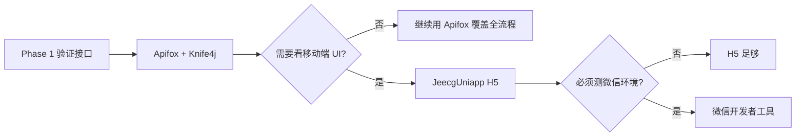

# 提案改善 — 移动端本地联调指南

> **适用对象**：以 Java 后端为主、尚未接触小程序/uni-app 的开发者  
> **关联文档**：[提案改善系统-实施规划.md](./提案改善系统-实施规划.md) · [README.md](./README.md)  
> **创建日期**：2026-08-28

---

## 1. 先搞清楚「小程序」在本项目指什么

| 概念 | 说明 |
|------|------|
| 技术栈 | **JeecgUniapp（uni-app）**，一份代码可编译为 H5、微信小程序、App、鸿蒙等 |
| 当前状态 | 本仓库 **`jeecg-uniapp/`** 目录（monorepo），基于官方 v3.0.0 二次开发 |
| 登录方式 | `POST /sys/login`，工号作为 `username`（= `workNo`） |
| 鉴权 | 请求头 `X-Access-Token: <JWT>`，与管理端 **共用同一套 Token** |
| API 前缀 | 共用 `/proposal/**` · 管理端 `/proposal/admin/**` · 移动端 `/proposal/app/**` |
| 交互原型 | `prototype/improveSys.html` 仅用于 UI 参考，**不会调用真实后端** |

---

## 2. 联调路线对比

按难度从低到高，可按阶段选用：

| 路线 | 方式 | 适合场景 | 是否需要小程序 |
|------|------|----------|----------------|
| **A** | Apifox / Postman + Knife4j | 后端接口验证（**首选**） | 否 |
| **B** | 浏览器打开 `improveSys.html` | 对照页面结构与字段 | 否 |
| **C** | JeecgUniapp **H5 模式** | 真实移动端 UI + 调接口 | 否（H5 即可） |
| **D** | 微信开发者工具 | 必须验证微信环境特性时 | 是 |



---

## 3. 路线 A：Apifox / Postman + Knife4j（后端开发者首选）

### 3.1 环境准备

1. **MySQL**
   - 导入 Jeecg 基础库：`jeecg-boot/db/jeecgboot-mysql-5.7.sql`
   - 执行业务脚本：`docs/improve/sql/proposal_init.sql`

2. **Redis**（登录 Token 缓存）

3. **启动 JeecgBoot**
   - 入口：`jeecg-boot/jeecg-module-system/jeecg-system-start`
   - 默认地址：`http://localhost:8080/jeecg-boot`

   本地 Docker 可选：

   ```bash
   docker-compose up -d jeecg-boot-mysql jeecg-boot-redis
   ```

   > 若使用 Docker，需将 `application-dev.yml` 中 MySQL/Redis 地址改为本机或容器地址。

4. **测试账号**
   - 默认管理员：`admin` / `123456`
   - 业务约定：员工以**工号**登录，`username = workNo`（需 HR 导入或手工创建用户）

### 3.2 API 文档

浏览器打开 Knife4j：

```text
http://localhost:8080/jeecg-boot/doc.html
```

在文档中可找到「小程序-首页」等 `/proposal/app/**` 接口。

### 3.3 调用示例

**Step 1 — 登录**

```http
POST http://localhost:8080/jeecg-boot/sys/login
Content-Type: application/json

{
  "username": "admin",
  "password": "123456"
}
```

响应 `result.token` 即为 JWT。

**Step 2 — 带 Token 访问移动端接口**

```http
GET http://localhost:8080/jeecg-boot/proposal/app/home
X-Access-Token: <上一步的 token>
```

**Step 3 — 其他常用接口**

| 方法 | 路径 | 说明 |
|------|------|------|
| GET | `/sys/user/getUserInfo` | 当前用户信息 |
| GET | `/proposal/app/home` | 小程序首页聚合 |
| GET | `/proposal/list` | 提案列表（共用） |
| POST | `/proposal` | 创建提案（共用） |
| POST | `/sys/common/upload` | 图片上传 |

### 3.4 Apifox 环境变量配置（推荐）

1. 新建环境变量：`baseUrl = http://localhost:8080/jeecg-boot`
2. 登录接口后置脚本提取 Token：

   ```javascript
   pm.environment.set("token", pm.response.json().result.token);
   ```

3. 全局 Header：`X-Access-Token: {{token}}`

---

## 4. 路线 B：浏览器原型（仅 UI 参考）

```text
用浏览器直接打开：docs/improve/prototype/improveSys.html
```

- 可查看 23 页页面结构、字段与交互流程
- **不能**验证后端接口
- 内网演示（可选）：http://192.168.123.92:9999/improveSys.html

---

## 5. 路线 C：JeecgUniapp H5 模式（推荐的真实移动端联调）

若需要「页面 + 真实接口」的体验，优先选 **H5**，不必先注册微信小程序。

### 5.1 官方源码与版本说明

| 项 | 说明 |
|----|------|
| 官方仓库（GitHub） | https://github.com/jeecgboot/JeecgUniapp |
| 官方仓库（Gitee） | https://gitee.com/jeecg/JeecgUniapp |
| 官方文档 | https://help.jeecg.com/uniapp3 |
| 最新 Release | **v3.0.0**（2025-03-10） |

> **重要**：JeecgUniapp **没有**与 JeecgBoot 同号的 `v3.9.3` 标签。  
> 移动端独立版本号为 **v3.0.0（Vue3 新版）**，通过 **同一套 `/sys/login` + JWT + `/sys/**` API** 与 JeecgBoot 3.9.x 对接，版本号不同但可配套使用。  
> 旧版 Vue2 最后一版为 **v2.0.1**，新项目请用 v3.0.0。

### 5.2 需要安装的工具

| 工具 | 版本要求 | 用途 |
|------|----------|------|
| Node.js | 18+ | 运行前端工程 |
| pnpm | 7.3+ | 依赖管理（官方推荐） |
| VS Code 或 HBuilderX | 任选 | 开发/运行（v3.0.0 已支持 VS Code，不强制 HBuilderX） |

### 5.3 源码位置（本仓库 monorepo）

移动端已与后端、Vue3 一并纳入 **CookieWu92/JeecgBoot** 仓库，无需单独 clone：

```text
spex-inside/（即 JeecgBoot 仓库根目录）
├── jeecg-boot/          # 后端
├── jeecgboot-vue3/      # 管理端
└── jeecg-uniapp/        # 移动端（基于官方 JeecgUniapp v3.0.0 二次开发）
```

> **说明**：`jeecg-uniapp/` 已移除独立 `.git`，与主仓库统一提交；后续不再跟踪官方 JeecgUniapp 更新。  
> 上游版本：**v3.0.0**（2025-03-10）。若新环境从零拉代码，`git clone` 本仓库即可，无需再拉官方 Uniapp 仓库。

### 5.4 配置后端地址

编辑 `env/.env.development`：

```properties
NODE_ENV = 'development'
VITE_DELETE_CONSOLE = false
VITE_SHOW_SOURCEMAP = true
# 改成你本机 JeecgBoot 地址
VITE_SERVER_BASEURL = 'http://localhost:8080/jeecg-boot'
```

> 变量必须以 `VITE_` 为前缀。其他配置保持默认即可。

### 5.5 安装依赖并启动 H5

```bash
cd jeecg-uniapp
pnpm i
pnpm run dev
```

浏览器访问控制台输出的本地地址（通常为 `http://localhost:5173` 或类似端口）。

### 5.6 联调注意事项

1. **跨域**：JeecgBoot 已配置 CORS，H5 开发模式一般可直接访问 `localhost:8080`。
2. **手机真机调试**：将 `VITE_SERVER_BASEURL` 中的 `localhost` 改为 PC 局域网 IP（如 `http://192.168.x.x:8080/jeecg-boot`），并确保防火墙放行 8080。
3. **登录**：使用 Jeecg 账号（工号+密码），与 Apifox 相同。
4. **提案业务页面**：JeecgUniapp 自带登录/首页/消息等基础页；**提案改善业务页需在本项目内二次开发**（见实施规划 §10.1 `src/pages/proposal/`）。

### 5.7 与本项目后端对接的检查清单

- [ ] 后端已启动，`/jeecg-boot/doc.html` 可访问
- [ ] `proposal_init.sql` 已执行
- [ ] `jeecg-uniapp/` 已在仓库根目录（本 monorepo 内，无需单独 clone）
- [ ] `VITE_SERVER_BASEURL` 指向本机后端
- [ ] `pnpm run dev` H5 可打开
- [ ] 登录成功，`/sys/user/getUserInfo` 返回正常
- [ ] `GET /proposal/app/home` 返回 200（需后端 Phase 1 接口已部署）

---

## 6. 路线 D：微信开发者工具（可选）

仅在需要验证微信小程序特有能力时使用（如订阅消息、真机扫码等）。

### 6.1 额外准备

| 项 | 说明 |
|----|------|
| 微信开发者工具 | https://developers.weixin.qq.com/miniprogram/dev/devtools/download.html |
| 小程序 AppID | 测试可用测试号或个人/企业小程序 |
| 编译产物 | HBuilderX「发行 → 小程序-微信」，或 uni-app CLI 编译到 `mp-weixin` |

### 6.2 本地调试技巧

- 开发者工具中勾选 **「不校验合法域名、web-view、TLS 版本」**，方可访问 `http://localhost` 后端。
- 正式环境需 HTTPS + 微信公众平台配置服务器域名白名单。
- 本项目登录为 **工号+密码**，非微信一键登录；微信工具主要用于容器与 UI 验证。

---

## 7. 后端环境速查

```text
MySQL
  ├── jeecg-boot/db/jeecgboot-mysql-5.7.sql   （Jeecg 基础表）
  └── docs/improve/sql/proposal_init.sql      （提案业务表 + 角色）

Redis          （登录 Session / Token 缓存）

JeecgBoot      http://localhost:8080/jeecg-boot
  ├── Knife4j  /doc.html
  ├── 登录     POST /sys/login
  └── 移动端   GET  /proposal/app/home  等
```

---

## 8. 常见问题

### Q1：没有小程序代码，能测后端吗？

可以。路线 A（Apifox + Knife4j）完全足够；移动端与管理端共用 Service 和 JWT，Apifox 测通即有效。

### Q2：JeecgUniapp 版本该选哪个？

选 **v3.0.0（Vue3 新版）**。不要与 JeecgBoot 的 `3.9.3` 版本号一一对应。

### Q3：`improveSys.html` 能联调后端吗？

不能。它只是静态 HTML 原型，用于 UI/字段对照。

### Q4：H5 和微信小程序有什么区别？

- **H5**：浏览器运行，配置简单，适合后端联调与业务开发。
- **微信小程序**：需微信开发者工具 + AppID，主要多一层微信容器与域名限制。

### Q5：提案业务页面在哪里？

JeecgUniapp 提供登录、首页、消息等**平台基础能力**；提案改善 23 页需按 `prototype/improveSys.html` 与实施规划在 `jeecg-uniapp/src/pages/proposal/` 下新建。

---

## 9. 相关链接

| 资源 | 地址 |
|------|------|
| 实施规划 | [提案改善系统-实施规划.md](./提案改善系统-实施规划.md) |
| 小程序原型 | [prototype/improveSys.html](./prototype/improveSys.html) |
| Phase 1 SQL | [sql/proposal_init.sql](./sql/proposal_init.sql) |
| 后端模块 | `jeecg-boot/jeecg-boot-module/jeecg-module-spex-inside/`（`org.jeecg.modules.proposal`） |
| JeecgBoot 文档 | https://help.jeecg.com |
| JeecgUniapp 文档 | https://help.jeecg.com/uniapp3 |
| JeecgUniapp 上游参考 | https://github.com/jeecgboot/JeecgUniapp（v3.0.0，本仓库已 vendored，不同步） |
| JeecgUniapp Gitee | https://gitee.com/jeecg/JeecgUniapp |

---

## 10. 推荐实施顺序

1. **先用路线 A** 跑通登录 + `/proposal/app/home` + 共用 `/proposal/**`
2. **对照路线 B** 原型确认页面与字段
3. **再走路线 C** 进入仓库内 `jeecg-uniapp/`，H5 联调平台基础能力
4. 在 JeecgUniapp 中开发提案业务页（Phase 1 目标：登录/首页/列表/我的 4 页）
5. 有微信环境需求时再走路线 D
