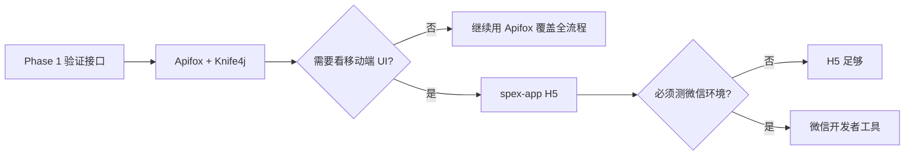

# 提案改善 — 移动端本地联调指南

> **适用对象**：以 Java 后端为主、尚未接触小程序/uni-app 的开发者  
> **关联文档**：[提案改善系统-实施规划.md](./提案改善系统-实施规划.md) · [README.md](./README.md) · [**小程序接口对接清单**](./api/提案小程序-接口对接清单.md)（发给 App 前端同事）  
> **创建日期**：2026-08-28

---

## 1. 先搞清楚「小程序」在本项目指什么

| 概念 | 说明 |
|------|------|
| 技术栈 | **uni-app（unibest）**，一份代码可编译为 H5、微信小程序、App 等 |
| **主工程** | 本仓库 **`spex-app/`**（见 `spex-app/README.spex.md`） |
| 登录方式 | `POST /sys/mLogin`，工号作为 `username`（= `workNo`） |
| 鉴权 | 请求头 `X-Access-Token: <JWT>`，与管理端 **共用同一套 Token** |
| API 前缀 | 共用 `/proposal/**` · 管理端 `/proposal/admin/**` · 移动端 `/proposal/app/**` |
| 交互原型 | `prototype/improveSys.html` 仅用于 UI 参考，**不会调用真实后端** |

---

## 2. 联调路线对比

按难度从低到高，可按阶段选用：

| 路线 | 方式 | 适合场景 | 是否需要小程序 |
|------|------|----------|----------------|
| **A** | Apifox / Postman + Knife4j | 后端接口验证（**首选**） | 否 |
| **B** | 浏览器打开 `improveSys.html` | 对照页面结构与字段 | 否 |
| **C** | **spex-app H5** | 真实移动端 UI + 调接口 | 否（H5 即可） |
| **D** | 微信开发者工具 | 必须验证微信环境特性时 | 是 |



---

## 3. 路线 A：Apifox / Postman + Knife4j（后端开发者首选）

### 3.1 环境准备

1. **MySQL**
   - 导入 Jeecg 基础库：`jeecg-boot/db/jeecgboot-mysql-5.7.sql`
   - 执行业务脚本：`docs/improve/sql/proposal_init.sql`

2. **Redis**（登录 Token 缓存）

3. **启动 JeecgBoot**
   - 入口：`jeecg-boot/jeecg-module-system/jeecg-system-start`
   - 默认地址：`http://localhost:8080/jeecg-boot`

   本地 Docker 可选：

   ```bash
   docker-compose up -d jeecg-boot-mysql jeecg-boot-redis
   ```

   > 若使用 Docker，需将 `application-dev.yml` 中 MySQL/Redis 地址改为本机或容器地址。

4. **测试账号**
   - 默认管理员：`admin` / `123456`
   - 业务约定：员工以**工号**登录，`username = workNo`（需 HR 导入或手工创建用户）

### 3.2 API 文档

浏览器打开 Knife4j：

```text
http://localhost:8080/jeecg-boot/doc.html
```

在文档中可找到「小程序-首页」等 `/proposal/app/**` 接口。

### 3.3 调用示例

**Step 1 — 登录**

```http
POST http://localhost:8080/jeecg-boot/sys/login
Content-Type: application/json

{
  "username": "admin",
  "password": "123456"
}
```

响应 `result.token` 即为 JWT。

**Step 2 — 带 Token 访问移动端接口**

```http
GET http://localhost:8080/jeecg-boot/proposal/app/home
X-Access-Token: <上一步的 token>
```

**Step 3 — 其他常用接口**

| 方法 | 路径 | 说明 |
|------|------|------|
| GET | `/sys/user/getUserInfo` | 当前用户信息 |
| GET | `/proposal/app/home` | 小程序首页聚合 |
| GET | `/proposal/meta/improvementDepts` | 改善部门选项（含负责人） |
| GET | `/proposal/list` | 提案列表（共用） |
| POST | `/proposal/create` | 创建提案草稿（共用） |
| PUT | `/proposal/{id}/draft` | 更新草稿 |
| PUT | `/proposal/{id}/submit` | 提交申请 |
| POST | `/sys/common/upload` | 图片上传 |

### 3.4 Apifox 环境变量配置（推荐）

1. 新建环境变量：`baseUrl = http://localhost:8080/jeecg-boot`
2. 登录接口后置脚本提取 Token：

   ```javascript
   pm.environment.set("token", pm.response.json().result.token);
   ```

3. 全局 Header：`X-Access-Token: {{token}}`

---

## 4. 路线 B：浏览器原型（仅 UI 参考）

```text
用浏览器直接打开：docs/improve/prototype/improveSys.html
```

- 可查看 23 页页面结构、字段与交互流程
- **不能**验证后端接口
- 内网演示（可选）：http://192.168.123.92:9999/improveSys.html

---

## 5. 路线 C：spex-app H5 模式（推荐的真实移动端联调）

若需要「页面 + 真实接口」的体验，优先选 **H5**，不必先注册微信小程序。

### 5.1 工程说明

| 项 | 说明 |
|----|------|
| 目录 | `spex-app/`（unibest 4.x + 提案业务页） |
| 说明文档 | [`spex-app/README.spex.md`](../../spex-app/README.spex.md) |
| Node | 20+ · pnpm 9+（以 `package.json` engines 为准） |

> **说明**：提案改善移动端以 `spex-app/` 为准（旧 `jeecg-uniapp/` 已移除）。

### 5.2 需要安装的工具

| 工具 | 版本要求 | 用途 |
|------|----------|------|
| Node.js | 20+ | 运行前端工程 |
| pnpm | 9+ | 依赖管理 |
| VS Code | 推荐 | 开发/运行 |

### 5.3 源码位置（本仓库 monorepo）

```text
spex-inside/
├── jeecg-boot/          # 后端
├── jeecgboot-vue3/      # 管理端
└── spex-app/            # 移动端（主）★
```
### 5.4 配置后端地址

`env/.env.development` 已指向本地后端：

```properties
VITE_SERVER_BASEURL = 'http://127.0.0.1:8080/jeecg-boot'
VITE_APP_PROXY_ENABLE = true
```

代理前缀见 `env/.env`：`VITE_APP_PROXY_PREFIX = '/api'`。

### 5.5 安装依赖并启动 H5

```bash
cd spex-app
pnpm i
pnpm run dev
```

浏览器访问控制台输出的本地地址（通常为 `http://localhost:9000`）。

### 5.6 联调注意事项

1. **跨域**：development 已开 Vite 代理（`/api` → `8080/jeecg-boot`）。
2. **手机真机调试**：将 `VITE_SERVER_BASEURL` 中的 `127.0.0.1` 改为 PC 局域网 IP，并确保防火墙放行 8080；真机调试时可暂时关闭代理、直连后端（注意 CORS）。
3. **登录**：`/sys/mLogin` + 工号密码；「体验登录」不走后端。
4. **提案业务页**：发起 / 列表 / 详情已接真实接口；委员审核、批准、统计等仍为 mock。

### 5.7 与本项目后端对接的检查清单

- [ ] 后端已启动，`/jeecg-boot/doc.html` 可访问
- [ ] `proposal_init.sql` 已执行
- [ ] `spex-app/` 已在仓库根目录
- [ ] `VITE_SERVER_BASEURL` 指向本机后端
- [ ] `pnpm run dev` H5 可打开
- [x] 真实账号登录成功（非「体验登录」）
- [x] 发起提案打通 `POST /proposal/create` + `submit`
- [x] 列表/详情对接 `/proposal/list`、`/proposal/{id}`
---

### 5.x 发起提案联调（2026-08-29）

1. 配置数据：`inside_dev` 已在管理端维护；种子 `proposal_config_seed.sql` 已与库内对齐。新环境才需要执行：

```bash
mysql -u root -p inside_dev < docs/improve/sql/proposal_spex_user_seed.sql
mysql -u root -p inside_dev < docs/improve/sql/proposal_config_seed.sql
```

2. 重启后端，H5 启动 `spex-app`（`pnpm run dev`）
3. 用工号登录样例账号，如 **`600081` / `123456`**（贺志龙，建议作提案人；吴浪 600099 已在委员会）
4. 首页入口进入 **发起提案**，填写内容（含通知邮箱）两步后提交
5. 「提案」Tab 应能看到刚提交的单据；管理端「提案管理」状态为待审核

> 注：委员审核 / 批准页仍为 mock，等 Phase 2 后端后再接。
联调角色速查（与 `inside_dev` 实配一致）：

| 角色 | 工号 | 姓名 |
|------|------|------|
| 提案人（建议） | 600081 | 贺志龙 |
| 部门负责人 · MES开发 | 600013 | 曾金 |
| 部门负责人 · 自动线开发部 | 600084 | 汪秦军 |
| 部门负责人 · 电气控制 | 600088 | 张小朋 |
| 批准人 | 600084 | 汪秦军 |
| 委员（席位 1~5，均评分） | 600013 / 600026 / 600051 / 600088 / 600099 | 曾金 / 陈泽波 / 刘恋 / 张小朋 / 吴浪 |

---

## 6. 路线 D：微信开发者工具（可选）

仅在需要验证微信小程序特有能力时使用（如订阅消息、真机扫码等）。

### 6.1 额外准备

| 项 | 说明 |
|----|------|
| 微信开发者工具 | https://developers.weixin.qq.com/miniprogram/dev/devtools/download.html |
| 小程序 AppID | 测试可用测试号或个人/企业小程序 |
| 编译产物 | HBuilderX「发行 → 小程序-微信」，或 uni-app CLI 编译到 `mp-weixin` |

### 6.2 本地调试技巧

- 开发者工具中勾选 **「不校验合法域名、web-view、TLS 版本」**，方可访问 `http://localhost` 后端。
- 正式环境需 HTTPS + 微信公众平台配置服务器域名白名单。
- 本项目登录为 **工号+密码**，非微信一键登录；微信工具主要用于容器与 UI 验证。

---

## 7. 后端环境速查

```text
MySQL
  ├── jeecg-boot/db/jeecgboot-mysql-5.7.sql   （Jeecg 基础表）
  └── docs/improve/sql/proposal_init.sql      （提案业务表 + 角色）

Redis          （登录 Session / Token 缓存）

JeecgBoot      http://localhost:8080/jeecg-boot
  ├── Knife4j  /doc.html
  ├── 登录     POST /sys/login
  └── 移动端   GET  /proposal/app/home  等
```

---

## 8. 常见问题

### Q1：没有小程序代码，能测后端吗？

可以。路线 A（Apifox + Knife4j）完全足够；移动端与管理端共用 Service 和 JWT，Apifox 测通即有效。

### Q2：移动端工程用哪个？

用本仓库 **`spex-app/`**（unibest）。旧 `jeecg-uniapp/` 已删除。

### Q3：`improveSys.html` 能联调后端吗？

不能。它只是静态 HTML 原型，用于 UI/字段对照。

### Q4：H5 和微信小程序有什么区别？

- **H5**：浏览器运行，配置简单，适合后端联调与业务开发。
- **微信小程序**：需微信开发者工具 + AppID，主要多一层微信容器与域名限制。

### Q5：提案业务页面在哪里？

在 `spex-app/src/pages/proposal/`（及 `todo` / `stats` 等）。对照原型 `prototype/improveSys.html`；API 见 `spex-app/src/api/proposal.ts`。

---

## 9. 相关链接

| 资源 | 地址 |
|------|------|
| 实施规划 | [提案改善系统-实施规划.md](./提案改善系统-实施规划.md) |
| 小程序原型 | [prototype/improveSys.html](./prototype/improveSys.html) |
| Phase 1 SQL | [sql/proposal_init.sql](./sql/proposal_init.sql) |
| 后端模块 | `jeecg-boot/jeecg-boot-module/jeecg-module-spex-inside/`（`org.jeecg.modules.proposal`） |
| 移动端工程 | `spex-app/`（[README.spex.md](../../spex-app/README.spex.md)） |
| JeecgBoot 文档 | https://help.jeecg.com |
| unibest 文档 | https://unibest.tech |

---

## 10. 推荐实施顺序

1. **先用路线 A** 跑通登录 + `/proposal/app/home` + 共用 `/proposal/**`
2. **对照路线 B** 原型确认页面与字段
3. **再走路线 C** 进入仓库内 `spex-app/`，H5 联调登录与提案业务
4. 有微信环境需求时再走路线 D
